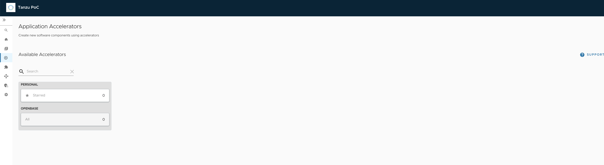
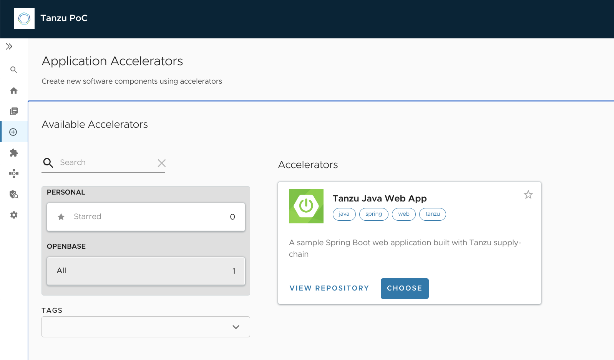

## Accelerator 커스터마이징

Application Accelerator for VMware Tanzu는 애플리케이션을 검색 가능하고 반복 가능한 방식으로 개발하고 배포하는 부트스트랩을 지원합니다.
Enterprise Architects는 조직의 개발자와 운영자에게 적합한 코드 및 구성을 제공하는 가속기 프로젝트를 작성하고 게시합니다.
게시된 가속기 프로젝트는 Git 저장소에서 유지 관리됩니다. 그런 다음 Application Accelerator를 사용하여 이러한 Accelerator 프로젝트를 기반으로 새 프로젝트를 생성할 수 있습니다.
이번 새션에서는 accelerator 삭재,생성,변경에 대해서 알아보도록 하겠습니다. 


### 1. 기존 등록되어 있는 acclerator를 삭재 해보겠습니다.
tap-values.yaml edit 합니다. 아래와 같이 tap-values.yaml에 있는 values을 apply 합니다.
sample:incloud: false를 추가합니다. 해당 스키마를 추가하지 않으면 acclerator는 삭재 되지 않습니다.

```cmd
accelerator:
  domain: <your-domain>
  ingress:
    include: true
    enable_tls: true
  tls:
    secret_name: share-secret
    namespace: tap-install
  server:
    service_type: "ClusterIP"
    watched_namespace: "accelerator-system"
<span style="color:red">  
  samples:
    include: false
</span>
```

<br/>
아래와 같이 tap-values.yaml을 update 합니다.

```cmd
tanzu package installed update tap --package-name tap.tanzu.vmware.com --version 1.4.2 --values-file tap-full-values.yaml -n tap-install
```


<br/>
기존에 등록된 accleator나 fragment가 있는지 조회합니다.
```cmd
tanzu acc list
tanzu acc frag list
```

<br/>
기 등록된 accleator, fragment 가 있다면 아래와 같이 삭재 합니다.

```cmd
tanzu accelerator delete <accelerator-name>
tanzu accelerator fragment delete <fragment-name>
```

<br/>
TAP GUI에서 accelerator 삭재가 되었는지 아래와 같이 확인 합니다.



<br/>


### 2. accelerator와 fragment 등록전에 "accelerator-system" 네임스페이스에 secret을 생성하겠습니다.

```cmd
kubectl create secret generic <your-secret-name>\
    --namespace accelerator-system \
    --from-literal=username=<git-user> \
    --from-literal=password=<git-password>


kubectl create secret generic git-https \
    --namespace accelerator-system \
    --from-literal=username=vmware \
    --from-literal=password=testtest
    <br/>
secret/git-https created
```

### 3. accelerator와 fragment를 등록 해보겠습니다.
각 개인의 private source repository로 아래 url를 clone하여 본인의 repository로 copy합니다. 
해당 git url에는 여러 accelerator와 fragment가 등록되어 있습니다.
url : https://github.com/vmware-tanzu/application-accelerator-samples


<br/>
각 개인 repository에서 accelerator와 fragment git url를 확인하여 edit하고, 2번에서 생성한 secret name을  secretRef: name에 edit합니다.
수정이 완료된 file은 vi anzu-java-web-app-acc.yaml insert합니다. 

```cmd
apiVersion: accelerator.apps.tanzu.vmware.com/v1alpha1
kind: Fragment
metadata:
  name: tap-workload
  namespace: accelerator-system
spec:
  displayName: TAP Workload
  git:
    ref:
      branch: main
    url: https://your-git-domain/your-repository-name/application-accelerator-samples/tree/main/fragments
    subPath: tap-workload
    secretRef:
      name: git-https
---
apiVersion: accelerator.apps.tanzu.vmware.com/v1alpha1
kind: Accelerator
metadata:
  name: tanzu-java-web-app
  namespace: accelerator-system
spec:
  git:
    ref:
      branch: main
    url: https://your-git-domain/your-repository-name/application-accelerator-samples
    subPath: tanzu-java-web-app
    secretRef:
      name: git-https
```

위 사항을 확인한 후, kubectl apply -f /your_path/tanzu-java-web-app-acc.yaml 적용합니다.
<br/>
```cmd
kubectl apply -f /var/tmp/tkgm/tap-install/tanzu-java-web-app-acc.yaml
fragment.accelerator.apps.tanzu.vmware.com/tap-workload created
accelerator.accelerator.apps.tanzu.vmware.com/tanzu-java-web-app created
```

<br/>
accelerator를 아래와 같이 update합니다.
```cmd
tanzu acc update tanzu-java-web-app --reconcile
accelerator tanzu-java-web-app updated successfully
```

<br/>
accelerator와 fragment가 정상적으로 생성이 되었는지 아래와 같이 확인합니다.
```cmd
tanzu acc list
NAME                 TAGS                      READY   REPOSITORY
tanzu-java-web-app   [java spring web tanzu]   true    https://your-git-domain/your-repository-name/accelerator:main:/tanzu-java-web-app
```

<br/>
```cmd
anzu acc frag list
NAME           READY   REPOSITORY
tap-workload   true    https://your-git-domain/your-repository-name/fragments:main:/tap-workload
```

<br/>
TAP GUI에서 accelerator가 생성되 었는지 확인 해보겠습니다.


