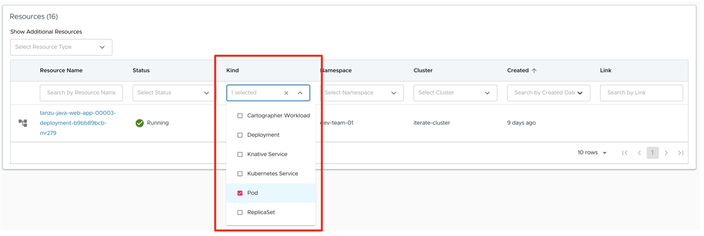
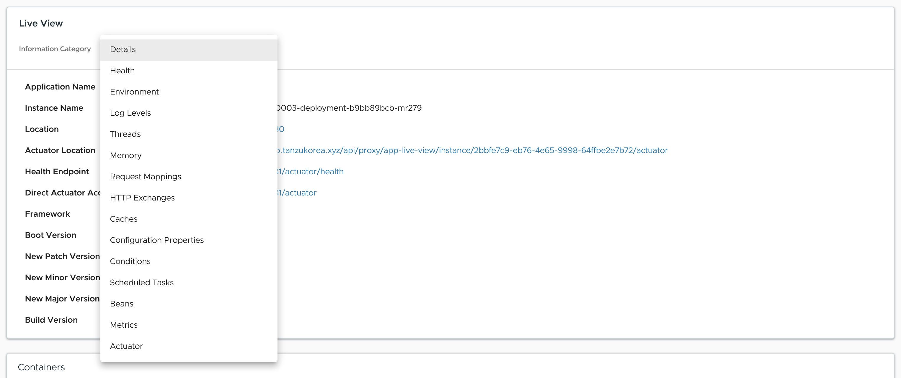

## Application Live View 둘러보기

본 과정에서는 TAP GUI에 포함된 Application Live View를 이용해 모니터링 하는 방법을 학습합니다.

### 1. 애플리케이션 사전 체크 사항
Application Live View는 Spring Boot 기반의 앱에서 Actuator 모듈을 추가했는지 확인합니다.

pom.xml 파일에 다음 artifact가 추가되었는지 확인합니다.

```xml
<dependency>
  <groupId>org.springframework.boot</groupId>
  <artifactId>spring-boot-starter-actuator</artifactId>
</dependency>
```

### 2. Spring Boot용 Application Live View
이 항목에서는 Spring Boot 앱에 대한 Application Live View 페이지에 대해 설명합니다.

#### 1) Application Live View 접속

Application Live View에 접속하는 순서는 다음과 같습니다.
- TAP GUI 내의 Organization Catalog 메뉴에서 카탈로그 선택
- "Runtime Resources" 탭 선택
- Kind에서 "Pod"를 체크하고 조회할 Pod 선택
  
- Live View 섹션에서 Actuator 엔드포인트를 선택하여 모니터링 및 간단한 트러블슈팅 정보 확인
  

#### 2) Application Live View 둘러보기

- [간단한 Application Live View 설명](./gui.md#2-application-live-view)
- 자세한 사항은 [VMware 영문 매뉴얼](https://docs.vmware.com/en/VMware-Tanzu-Application-Platform/1.4/tap/tap-gui-plugins-app-live-view-springboot.html)을 참고하시기 바랍니다.
