## TAP를 이용해서 APP 배포하고 TAP GUI에 워크로드 등록 및 조회합니다.

본 과정에서는 TAP (Tanzu Application Platform)를 이용하여 쉽게 애플리케이션을 배포하는 방법에 대해 학습합니다.

* Tanzu CLI 명령을 실행하여 앱을 배포합니다.
* 앱의 빌드 및 런타임 로그를 봅니다.
* 브라우저에서 배포된 앱을 확인합니다.
* TAP GUI에서 워크로드 등록하고 조회합니다.
* tanzu-java-web-app accelerator를 본인의 로컬로 다운로드 합니다.
* 개인 Git 저장소에 업로드 합니다. 
* TAP GUI에서 app live view를 보기 위한 app을 배포합니다.


### 1.앱 배포
다음과 같이 2가지 방법으로 TAP를 이용하여 워크로드를 생성할 수 있습니다.
* tanzu CLI를 이용하여 생성
* workload 파일을 이용하여 생성

이번 랩에서는 tanzu CLI 파일을 작성하여 워크로드를 생성하는 방법으로 랩을 진행합니다.
앱 소스는 아래 git에서 가져옵니다. 해당 git을 clone하여 각 개인의 github나 gitlab의 래퍼지토리를 복사하여 사용하거나 해당 git url을 사용해도 괜찮습니다. 다음과 같이 cmd 파일을 실행합니다.
<br/>
**주의 : namespace는 앞에서 워크로드 배포를 위한 개발자용 네임스페이스 구성시 설정했던 namespace로 사용합니다.** <br/>

`
```cmd
tanzu apps workload create tanzu-java-web-app \
--git-repo https://github.com/sample-accelerators/tanzu-java-web-app \
--git-branch main \
--type web \
--label app.kubernetes.io/part-of=tanzu-java-web-app \
--yes \
--namespace default
```

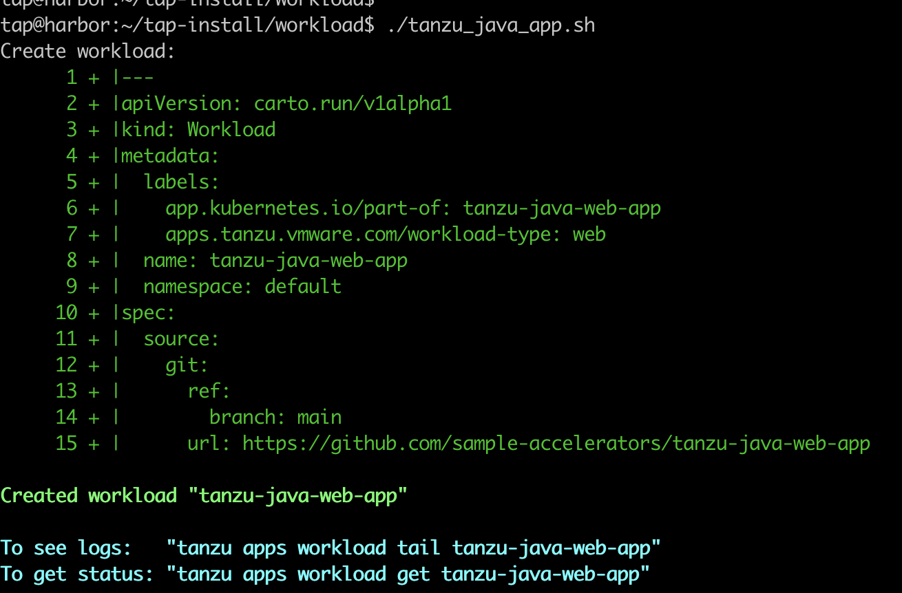
위와 같은 출력이 나타나면 "y" 를 입력하고 계속해서 워크로드 생성을 진행합니다.


### 2. 로그 확인
이제 워크로드가 잘 생성되고 있는지 다음 명령어를 이용해서 확인해 봅니다.
<br/>
> 워크로드 목록 조회
```cmd
tanzu apps workload list
```

> 방금 생성한 "tanzu-java-web-app" 워크로드 조회 (워크로드 명 확인)
```cmd
tanzu apps workload get tanzu-java-web-app
```

TAP에서 수행되는 모든 행위들은 pod 기반으로 작동됩니다. git에서 참조하는 애플리케이션 소스를 기반으로 빌드를 수행해 주는 pod가 실행되고 있음을 알 수 있습니다.
```cmd
kubectl get pod
```
다음과 같은 화면이 출력될 것입니다.
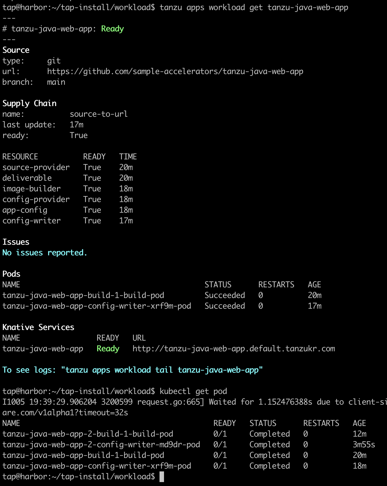

빌드 pod 안에서 구동되는 여러 컨테이너들이 순차적으로 작업을 수행하게 되고, 이 작업이 완료되기까지 약 5~10분 정도 소요됩니다.

빌드가 완료되고 나면 컨테이너가 생성되는데, 워크로드가 생성되는 일련의 과정들에 대한 로그 조회는 다음과 같은 커맨드로 확인 가능합니다.
```cmd
tanzu apps workload tail tanzu-java-web-app
```
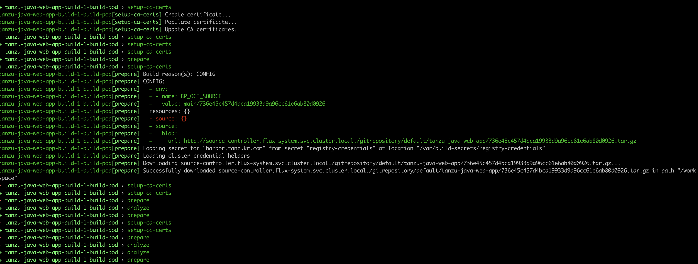


모든 작업이 완료되고 나면 pod 조회 시 다음과 같은 화면이 출력됩니다.
```cmd
kubectl get pod
```
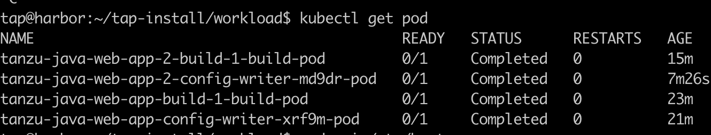

워크로드가 실행될 애플리케이션 파드가 보이지 않습니다. TAP가 생성한 pod들은 knative (serverless) 기반이기 때문에, 실제 호출이 일어나지 않으면 pod가 생성되지 않습니다.


로컬 PC에서 앱 호출을 확인하기 위해 /etc/hosts에 아래와 같이 추가하겠습니다.

```cmd
10.220.58.104 tanzu-java-web-app.default.tanzukr.com
```

이제 앱을 호출해 보도록 하겠습니다.

URL: http://tanzu-java-web-app.default.tanzukr.com/

웹페이지는 아래와 같이 나타나게 됩니다.

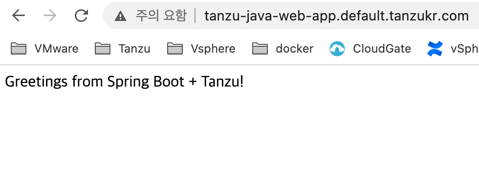

이제 pod를 조회하여 실제 애플리케이션 pod가 생성되었는지를 확인합니다.
```cmd
kubectl get pod
```
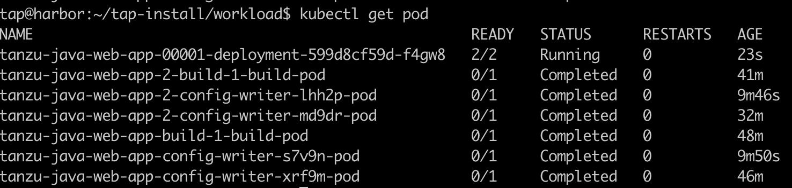

### 3. 그 밖의 tanzu 명령어
> 워크로드 삭제
```cmd
tanzu apps workload delete tanzu-java-web-app
```

> 기타 Tanzu CLI 참조

https://docs.vmware.com/en/VMware-Tanzu-Application-Platform/1.2/tap/GUID-cli-plugins-apps-command-reference.html

### 4. TAP GUI 접속
다음 링크를 클릭하여 TAP GUI에 접속합니다.

URL: http://tap-gui.tanzukr.com/

최초 접속 화면은 다음과 같습니다. "Enter" 버튼을 클릭합니다.


### 5. TAP GUI에서 워크로드 등록

홈 화면에 접속하였습니다. 이전에 생성한 워크로드 등록을 위하여 "REGISTRY ENTITY" 버튼을 클릭합니다.


등록할 컴포넌트 정보를 가지고 있는 yaml 파일의 URL을 입력하고, "ANALYZE" 버튼을 클릭합니다.

URL: https://github.com/sample-accelerators/tanzu-java-web-app/tree/main/catalog/catalog-info.yaml


등록된 컴포넌트의 내용을 확인하고 "IMPORT" 버튼을 클릭합니다.


이제 컴포넌트 등록이 완료되었습니다.


### 6. TAP GUI에서 워크로드 조회
홈 메뉴로 돌아가서, 내가 생성한 워크로드가 등록되었는지 확인하고, 워크로드 명을 클릭하여 워크로드를 조회합니다.


워크로드의 간략한 개요를 확인합니다.


"Runtime Resources" 탭을 클릭하여 워크로드와 관련된 리소스들을 확인합니다.


해당 워크로드를 드릴다운하여, 관련된 여러 리소스들을 확인합니다. Deployment, Pod 등 다양한 리소스를 확인할 수 있습니다. 만일 Pod 정보가 보이지 않는다면, 웹 호출이 없어서 Pod가 중지된 것일 수 있습니다. 브라우저에서 해당 웹페이지에 접속하여 Pod를 구동시켜 준 뒤, 페이지를 리로드 하면 Pod 정보까지 조회됩니다.


계층 구조를 가진 다양한 리소스들을 확인할 수 있습니다.


### 7. accelerator 다운로드 및 개인 Git 저장소에 업로드 
TAP-GUI의 accelerator로 메뉴로 접속하여  "CHOOSE" 버튼을 클릭합니다.
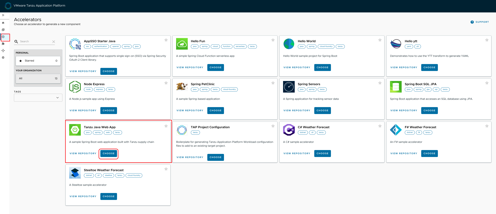

Name, Prefix 값을 입력하고 "NEXT" 버튼을 클릭합니다.
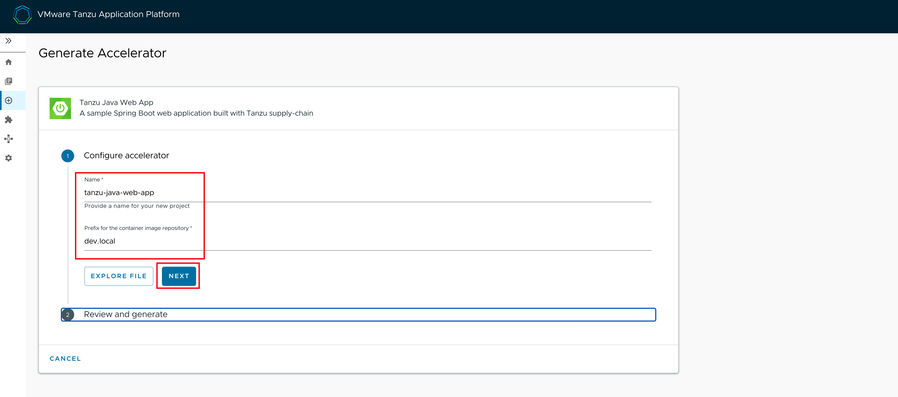

"GENERATE ACCELERATOR" 버튼을 클릭합니다.
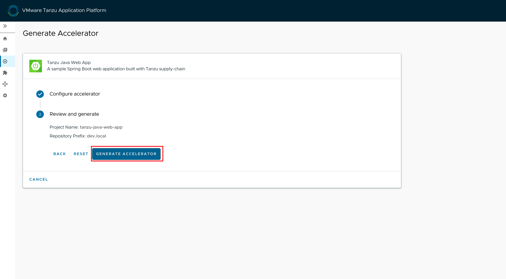

"DOWNLOAD ZIP FILE" 버튼을 클릭하고, 로컬 PC로 다운로드를 확인합니다.


GITHUB에서 아래와 같이 repository를 생성합니다.
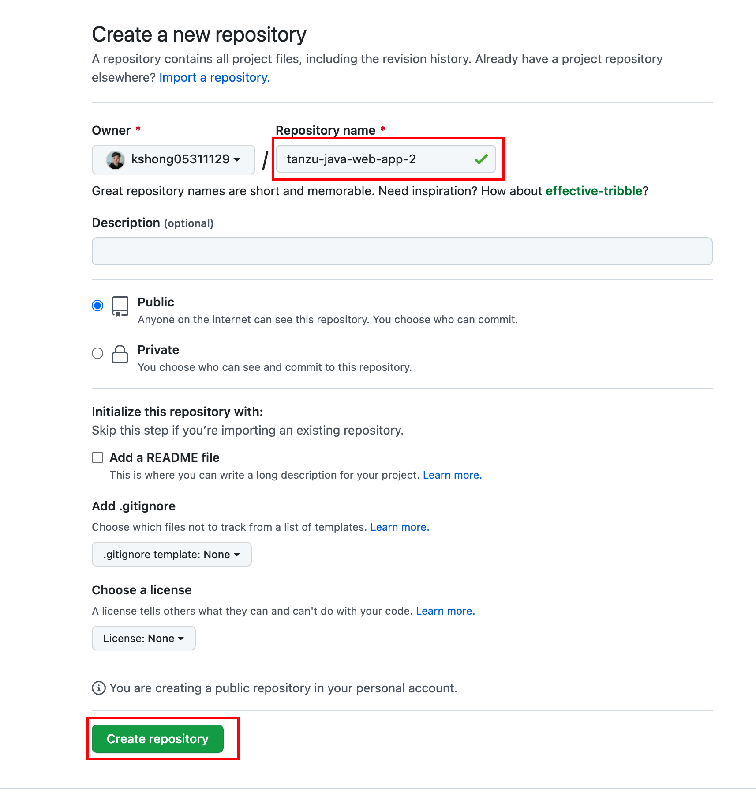

압축을 푼후 해당 폴더로 들어온후, 아래와 같이 위에서 생성한 저장소로 업로드 합니다.

`
```cmd
git init
git add --all
git commit -m "first commit"
git branch -M main
git remote add origin https://github.com/kshong05311129/tanzu-java-web-app-2.git(본인의 git repository 경로)
git push -u origin main
```
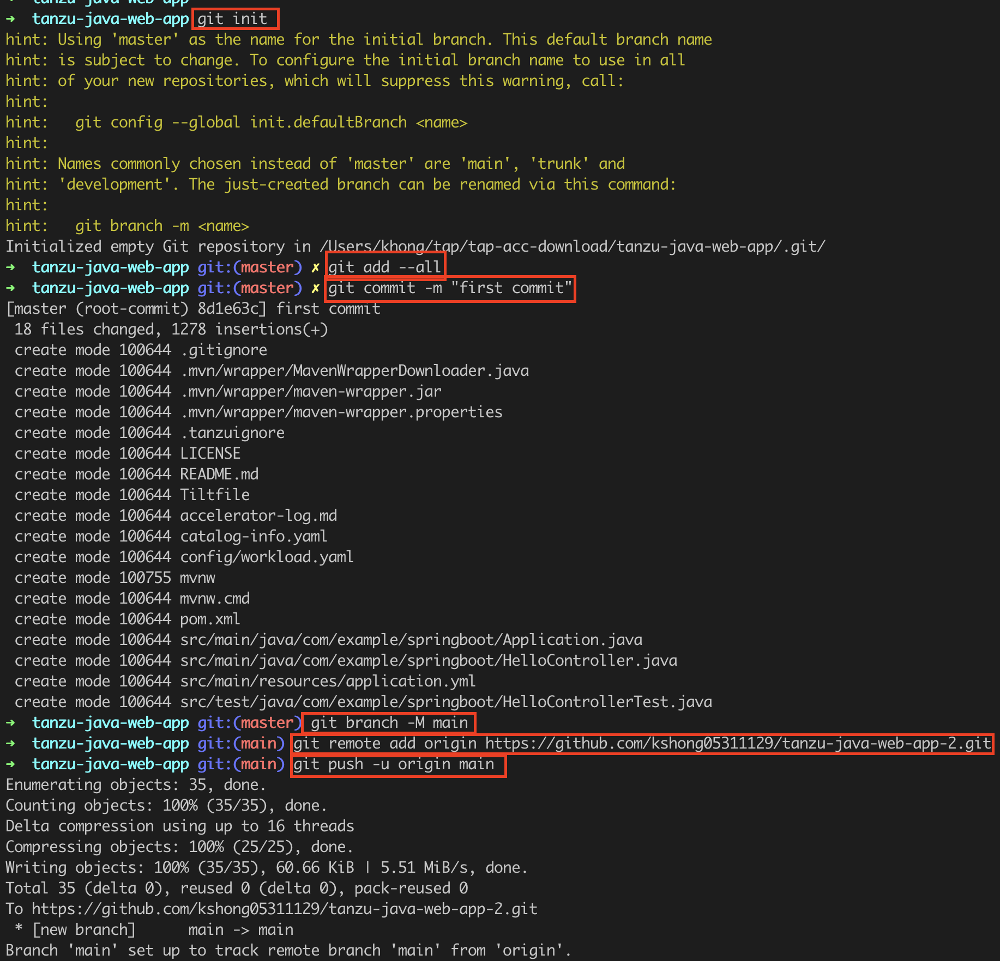


위 작업후 github repository를 접속하면 정상적으로 소스파일이 업로드 됨을 확인할 수 있습니다.
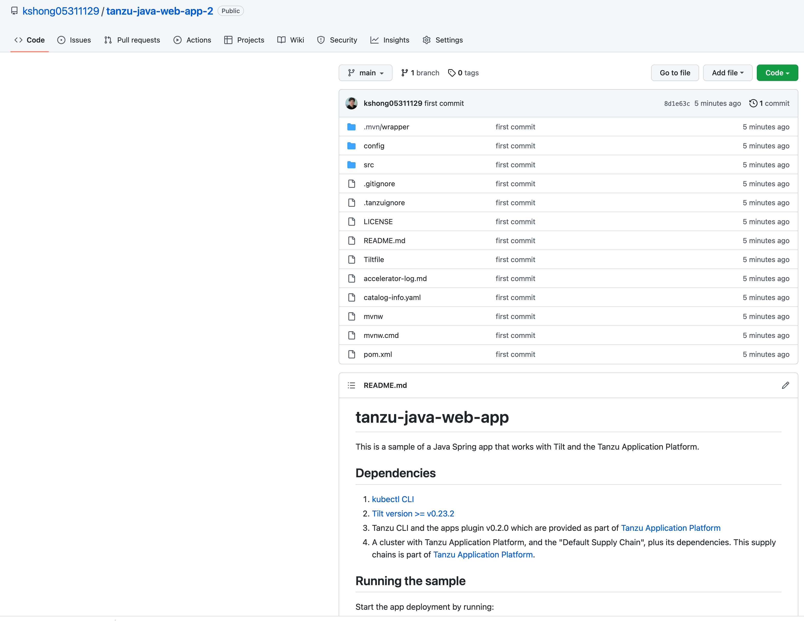


### 8. APP LIVE VIEW 조회를 위한 워크로드 배포

git-repo는 위에서 생성한 git https 경로를 가져옵니다. 다음과 같이 cmd 파일을 실행합니다.
<br/>
**주의 : namespace는 앞에서 워크로드 배포를 위한 개발자용 네임스페이스 구성시 설정했던 네임스페이스로 사용합니다.** <br/>

`
```cmd
tanzu apps workload create tanzu-java-web-app-live-view \
--git-repo https://github.com/kshong05311129/tanzu-java-web-app2 \
--git-branch main \
--type web \
--label app.kubernetes.io/part-of=tanzu-java-web-app-live-view \
--label tanzu.app.live.view=true \
--label tanzu.app.live.view.application.name=tanzu-java-web-app-live-view \
--annotation autoscaling.knative.dev/minScale=1 \
--yes \
--namespace default
```

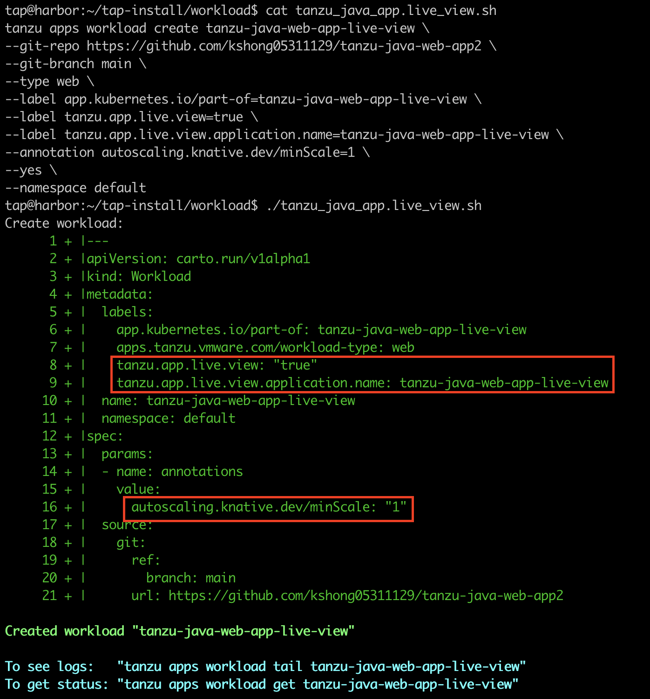
위와 같은 출력이 나타나면 "y" 를 입력하고 계속해서 워크로드 생성을 진행합니다.

