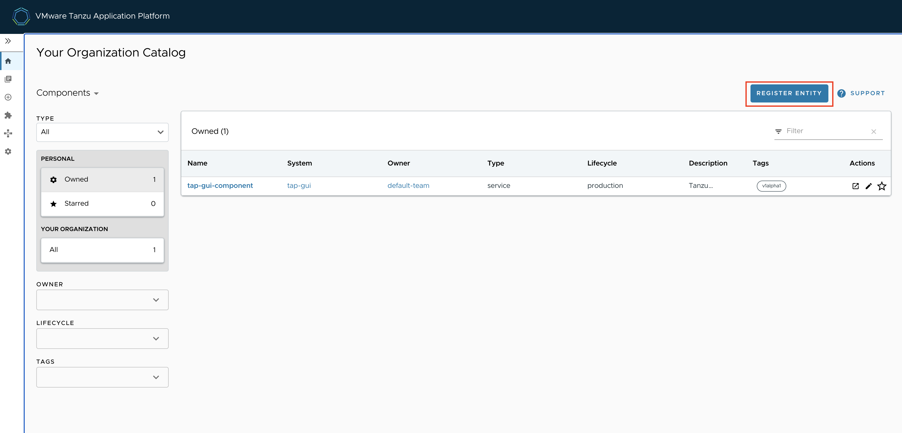
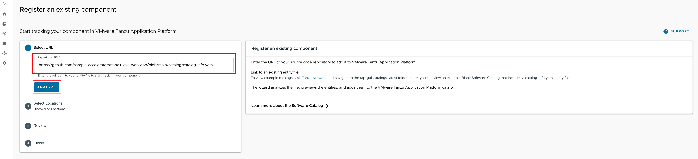
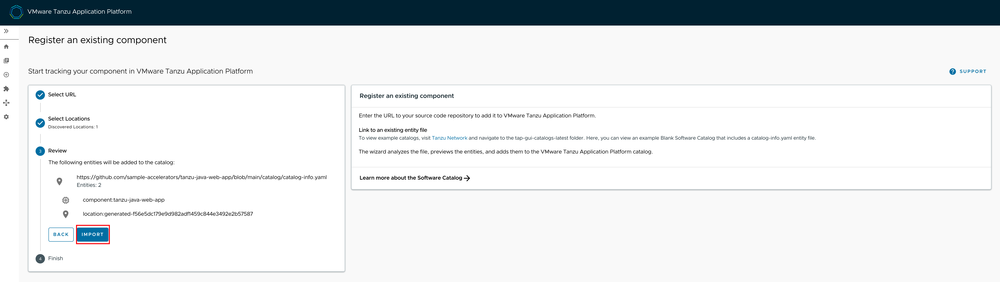
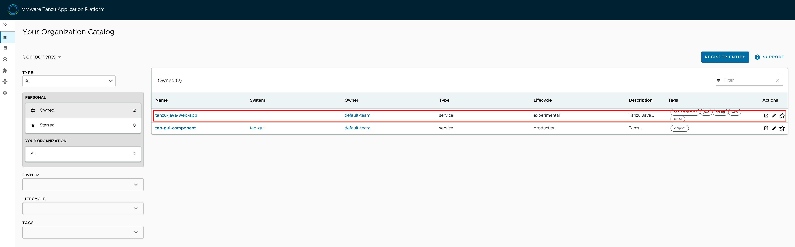
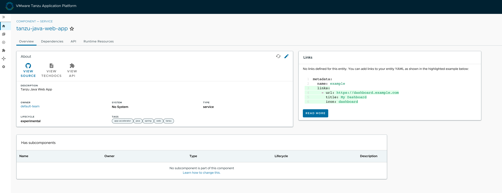
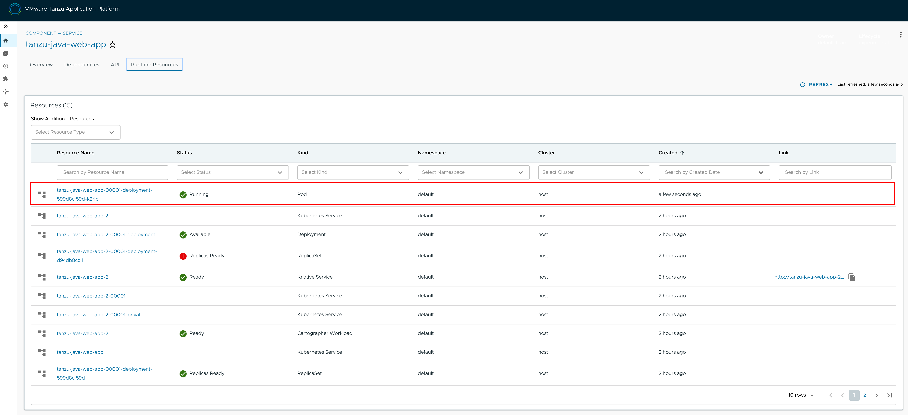
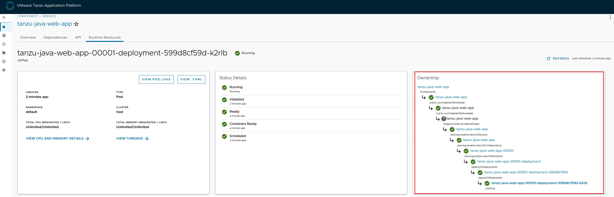

## TAP GUI에서 배포된 워크로드 확인하기

이번 실습에서는 이전 단계에서 배포한 워크로드를 TAP GUI에서 확인해 보는 실습을 진행합니다.

### 1. TAP GUI 접속
다음 링크를 클릭하여 TAP GUI에 접속합니다.

URL: http://tap-gui.tanzukr.com/

최초 접속 화면은 다음과 같습니다. "Enter" 버튼을 클릭합니다.

### 2. TAP GUI에서 워크로드 등록

홈 화면에 접속하였습니다. 이전에 생성한 워크로드 등록을 위하여 "REGISTRY ENTITY" 버튼을 클릭합니다.

등록할 컴포넌트 정보를 가지고 있는 yaml 파일의 URL을 입력하고, "ANALYZE" 버튼을 클릭합니다.

URL: https://github.com/kshong05311129/tanzu-java-web-app-tap-hol/tree/master/catalog/*.yaml

등록된 컴포넌트의 내용을 확인하고 "IMPORT" 버튼을 클릭합니다.

이제 컴포넌트 등록이 완료되었습니다.

### 3. TAP GUI에서 워크로드 조회
홈 메뉴로 돌아가서, 내가 생성한 워크로드가 등록되었는지 확인하고, 워크로드 명을 클릭하여 워크로드를 조회합니다.

워크로드의 간략한 개요를 확인합니다.

"Runtime Resources" 탭을 클릭하여 워크로드와 관련된 리소스들을 확인합니다.

해당 워크로드를 드릴다운하여, 관련된 여러 리소스들을 확인합니다. Deployment, Pod 등 다양한 리소스를 확인할 수 있습니다. 만일 Pod 정보가 보이지 않는다면, 웹 호출이 없어서 Pod가 중지된 것일 수 있습니다. 브라우저에서 해당 웹페이지에 접속하여 Pod를 구동시켜 준 뒤, 페이지를 리로드 하면 Pod 정보까지 조회됩니다.

계층 구조를 가진 다양한 리소스들을 확인할 수 있습니다.

### 4. TAP GUI에서 워크로드 등록(APP LIVE VIEW 확인을 위해서)

2.6(APP LIVE VIEW 조회를 위한 워크로드 배포)에서 실습한 각 개인 계정의 git repo에 배포한 catalog-info.yaml 파일 경로로 위 과정을 반복하여 TAP GUI 에서 워크로드를 등록합니다.
URL: https://github.com/kshong05311129/tanzu-java-web-app2/blob/main/catalog-info.yaml