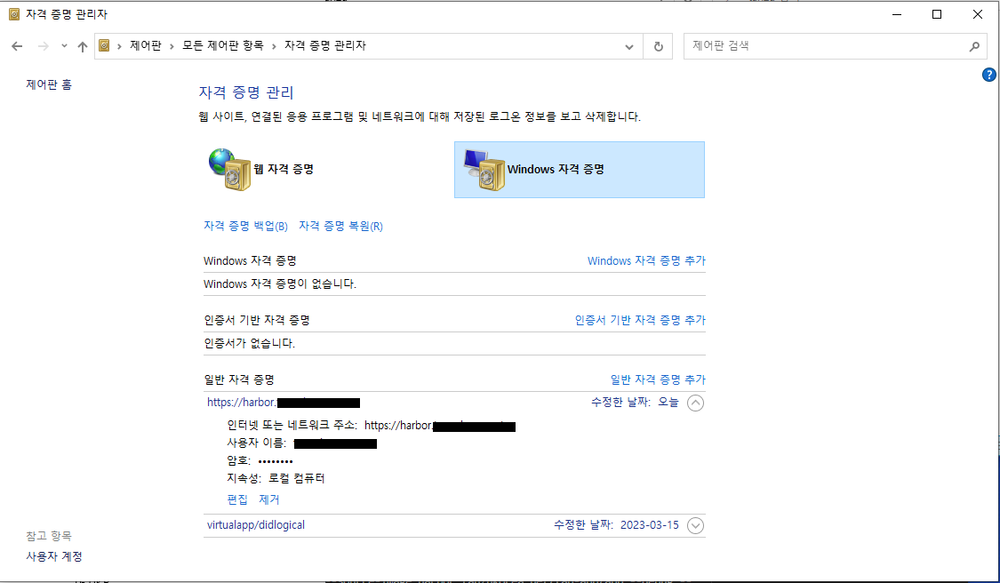

## Docker Registry 에 접속하기 위한 Credential 생성하기

1. docker credential 생성을 위한 프로그램을 아래의 주소에서 다운로드 받습니다.

    https://github.com/docker/docker-credential-helpers/releases

    [윈도우즈 버전 다운로드 바로가기](https://github.com/docker/docker-credential-helpers/releases/download/v0.7.0/docker-credential-wincred-v0.7.0.windows-amd64.exe)

2. 이 파일을 docker-credential-wincred.exe 로 이름을 변경합니다.

3. PATH가 잡혀 있는 곳으로 파일을 복사합니다. (예: C:\Program Files\tanzu 디렉토리)
4. 현재 계정의 HOME에 .docker 디렉토리를 생성합니다.
5. .docker 디렉토리에 파일명을 config.json 으로 생성하고 아래의 내용을 넣습니다.
    ```
    {
    "credsStore": "wincred"
    }
    ```
6. 아무 경로에서 credential.json 파일을 생성하고 docker registry 주소와 id, password 정보를 아래와 같이 입력합니다.
    ```
    {
            "serverurl": "https://harbor.xxx.xxxx",
            "username": "id",
            "secret" :  "password"
    }
    ```
7. 명령 프롬프트(cmd)를 열고 위 credential.json 파일이 있는 위치에서 아래의 명령어를 실행합니다.
    ```
        type credential.json | docker-credential-wincred store
    ```
8. credential이 정상적으로 생성이 되었는지 확인합니다.
    ```
        C:\Users\wyatt>docker-credential-wincred list
        {"https://harbor.xxx.xxxx":"id"}
    ```
9. 계정이 정상적으로 생성이 되면 제어판->자격 증명 관리자에서 확인이 가능합니다.
