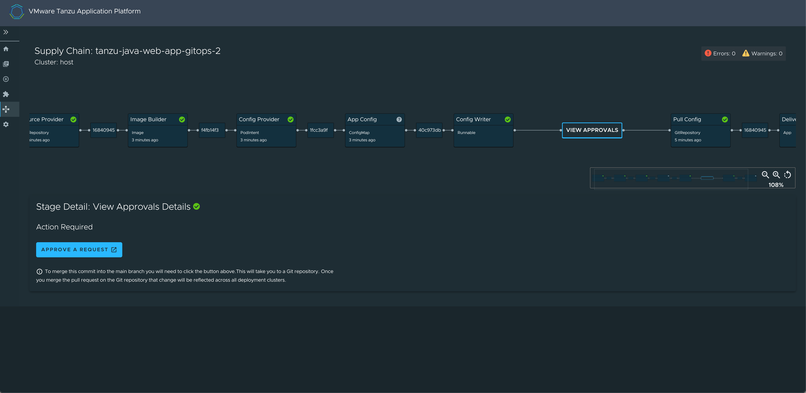
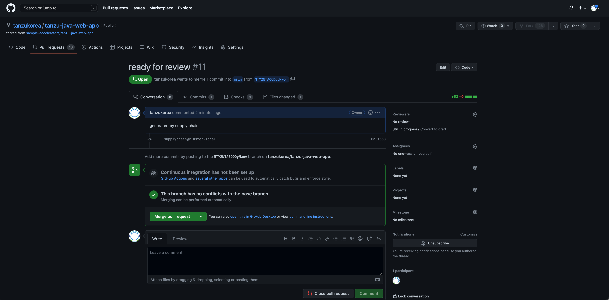

# GitOps

본 과정에서는 GitOps 접근 방식을 사용하여 Kubernetes 구성을 원격 Git 저장소로 푸시하도록 Supply Chain을 설정합니다.

## 1. GitOps 적용

### 1) HTTP(S) Basic-auth
구성 정보를 담을 repository가 https:// 또는 http:// 를 사용한다면, Kubernetes 시크릿은 다음과 같이 해당 repository에 대한 credential을 제공해야 합니다.  
다음 Yaml 파일 예시를 참고하여 작성합니다. GIT-USERNAME에는 본인의 github id, GIT-PASSWORD에는 본인의 github token 정보를 사용합니다.  

~~~
apiVersion: v1
kind: Secret
metadata:
  name: git-http  # `git-ssh` is the default name.
                        #   - operators can change such default by using the
                        #     `gitops.ssh_secret` property in `tap-values.yaml`
                        #   - developers can override by using the workload parameter
                        #     named `gitops_ssh_secret`.
  annotations:
    tekton.dev/git-0: https://github.com        # ! required
type: kubernetes.io/basic-auth          # ! required
stringData:
  username: GIT-USERNAME
  password: GIT-PASSWORD
~~~

작성 완료 후 해당 파일을 적용합니다.

~~~
kubectl apply -f gitops-http-auth.yaml
~~~

### 2) ServiceAccount 작성
secret 생성 이후에는 workload에서 사용하는 serviceaccount와 붙이는 과정이 필요합니다. 다음 yaml 파일을 적용합니다.
~~~
apiVersion: v1
kind: ServiceAccount
metadata:
  name: default
secrets:
  - name: registry-credentials
  - name: tap-registry
  - name: git-http
imagePullSecrets:
  - name: registry-credentials
  - name: tap-registry
~~~

### 3) tap-values.yaml 파일 수정
tap-values.yaml의 ootb_supply_chain 항목을 다음과 같이 수정합니다.  
GIT-USERNAME에는 본인의 github 계정 정보를 입력하며, 이때 본인의 계정 아래에 tanzu-java-web-app이라는 Repository가 있는지 확인하고 진행합니다.
~~~
ootb_supply_chain_basic:
   gitops:
     server_address: https://github.com/
     repository_owner: GIT-USERNAME
     repository_name: tanzu-java-web-app
     branch: main
     ssh_secret: git-http
     commit_strategy: pull_request
     pull_request:
       server_kind: github
       commit_branch: ""
       pull_request_title: ready for review
       pull_request_body: generated by supply chain
 ~~~
다음으로 수정된 profile을 업데이트합니다.

~~~
tanzu package installed update tap -p tap.tanzu.vmware.com -v 1.2.1 --values-file tap-values.yaml -n tap-install
~~~

### 4) 애플리케이션 배포
다음을 실행하여 애플리케이션을 배포합니다
~~~
tanzu apps workload create tanzu-java-web-app-gitops-2 \
  --git-branch main \
  --git-repo https://github.com/tanzukorea/tanzu-java-web-app \
  --label app.kubernetes.io/part-of=tanzu-java-web-app \
  --type web
~~~

## 2. GitOps 적용된 내용 GUI에서 확인
### 1) GUI의 Supply Chain 화면 접속
Supply Chain으로 가면 이전과 달리 Config Writer와 Pull Config 사이에 "View Approvals"라는 버튼이 추가된 것을 확인할 수 있습니다. 해당 버튼을 클릭합니다.

아래의 Approve a Request 버튼을 클릭하면 Github로 연결됩니다.

위 사진과 같이 설정했던 리뷰 문구가 표시되고, commit 내용 및 변경된 파일 확인, comment 작성, merge 수행 등이 가능합니다.  

