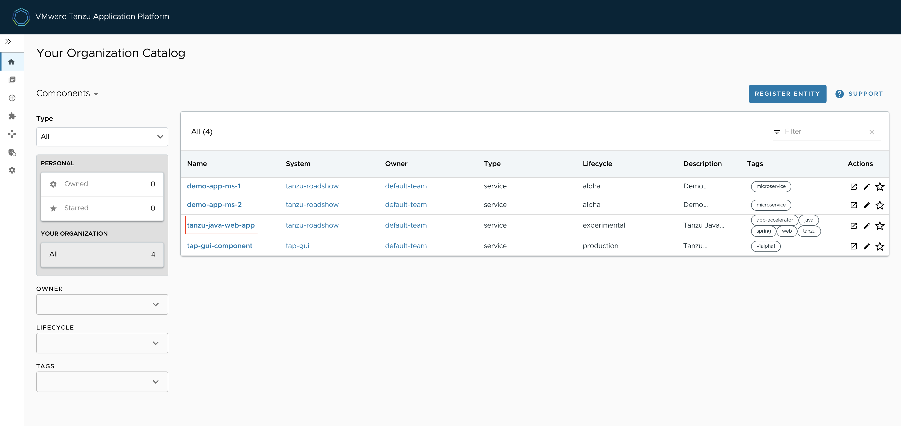
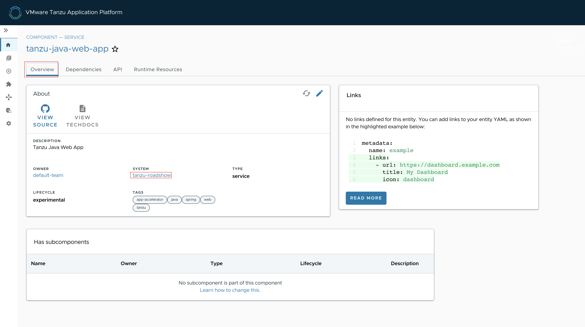
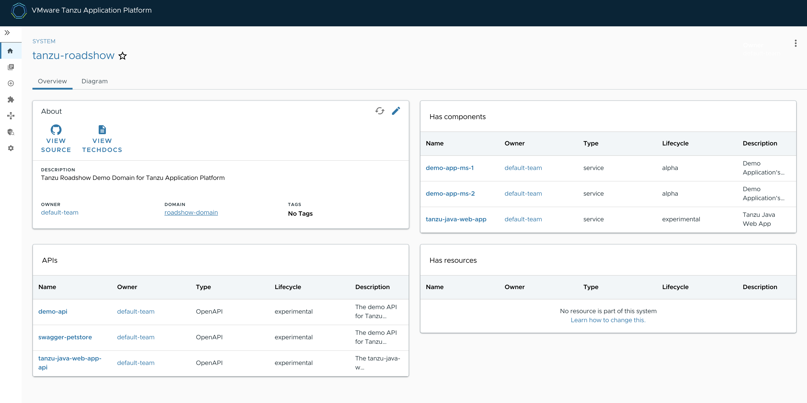
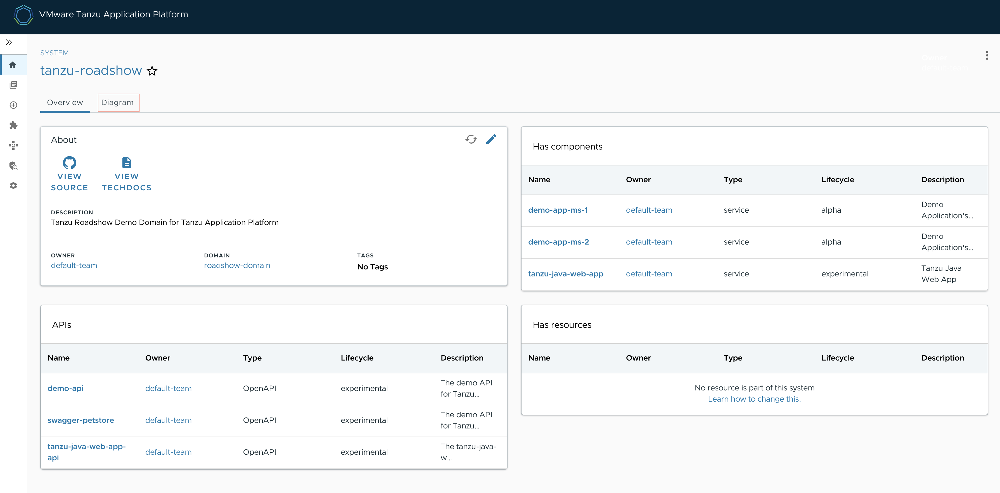
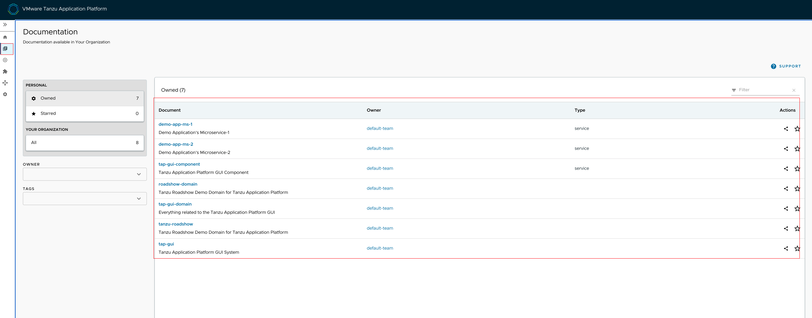
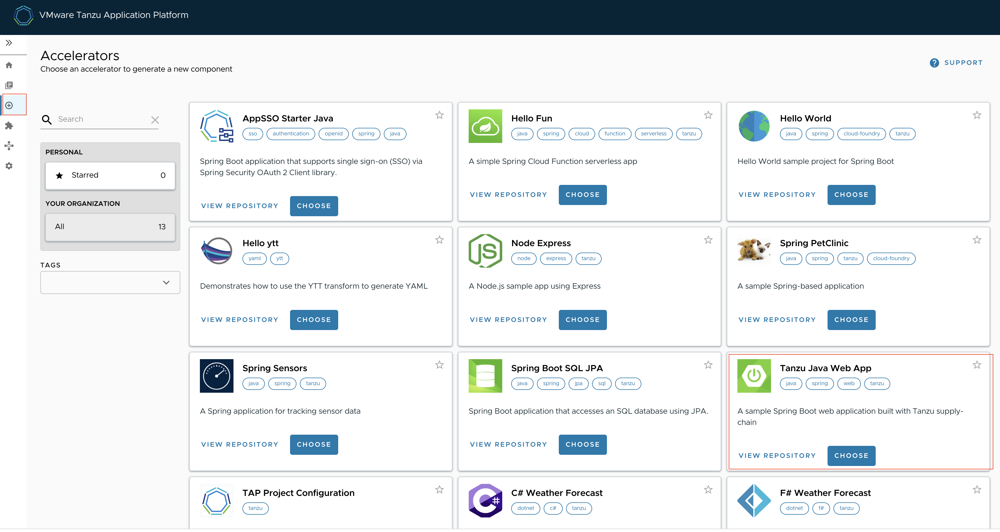
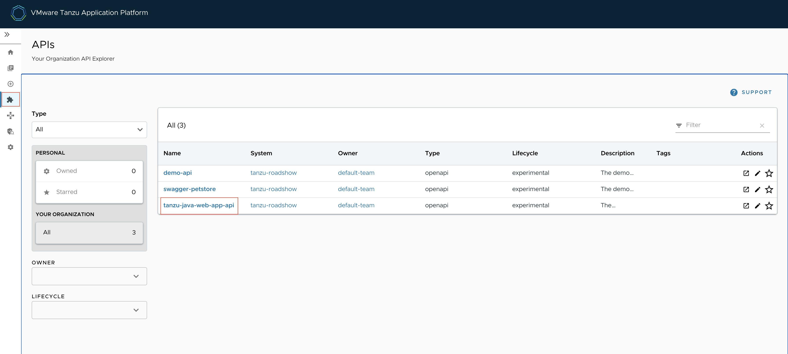
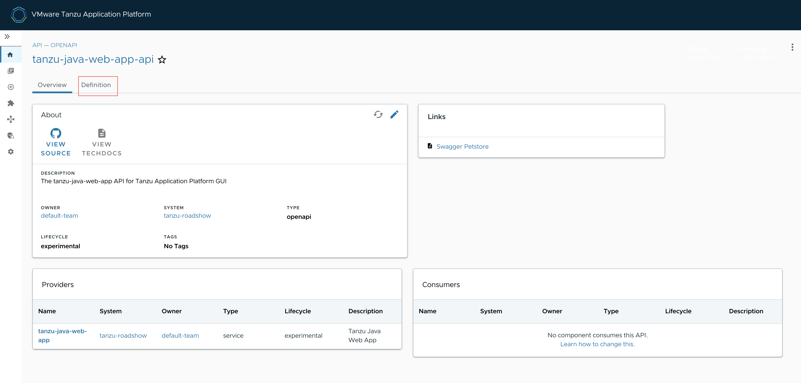
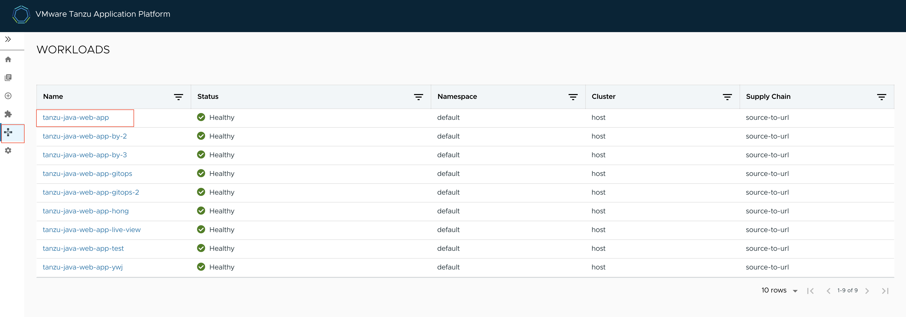
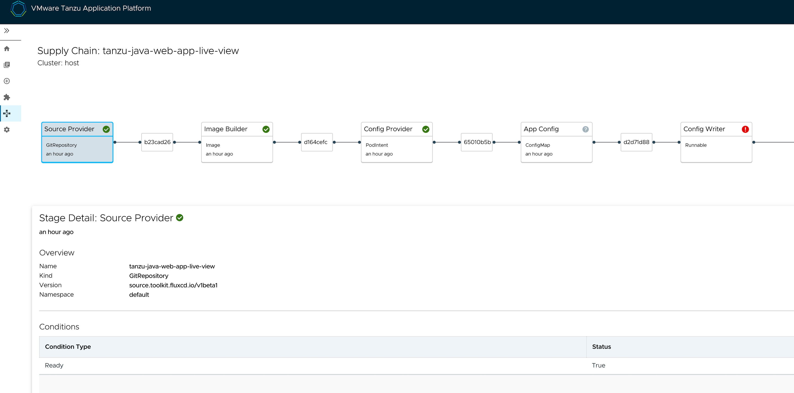

## Tanzu Application Paltform GUI 알아보기
이번 실습에서는 Spring Boot 앱에서 개발자들에게 제공되는 Actuator를 기반으로 한 정보들을 TAP에서 효과적으로 보여줄 수 있는 방법과 
그리고 TAP GUI 화면들에서 대해서 알아보겠습니다.

### 1. TAP GUI 메뉴 둘러보기
TAP GUI의 메뉴들을 살펴보도록 하겠습니다.

#### Catalog
앞 세션에서 App를 배포하고 해당 App들이 등록된 화면입니다.

Catalog 목록중 "tanzu-java-web-app"을 클릭 해보겠습니다.

SYSTEM의 "tanzu-roadshow"을 클릭 해보겠습니다.

오른쪽에 Has components목록과 APIs 목록을 확인 할 수 있습니다.

"Diagram" 클릭하겠습니다.

"Diagram" 확인 할 수 있습니다.

#### Documentation
배포한 APP들의 상세한 설명을 볼 수 있는 메뉴입니다.

#### Accelerators
APP들을  Accelerators에 등록할수 있으며, 현재 등록된 App들을 보여주는 메뉴입니다. 

#### APIs
API 목록을 확인 할 수 있는 메뉴입니다.

"tanzu-java-web-app-api" 클릭합니다.

"Definition"을 클릭합니다.

API 목록을 확인 할 수 있습니다.

#### WORKLOADS
배포된 Workload 목록을 확인 할 수 있습니다.

"tanzu-java-web-app" 을 클릭합니다.

tanzu-java-web-app의 파이프라인  정보 및 단계별 상황을 확인 할 수 있습니다. 

### 2. Application Live View
Application Live View는 "Runtime Resources" 탭에서 Spring Boot 애플리케이션으로 구동된 Pod에 대한 정보를 조회할 때 보여지는 화면입니다.

Spring Boot 애플리케이션의 경우 다음과 같은 화면을 볼 수 있습니다. Actuator Location에 표시되는 링크를 클릭하면, Actuator가 제공하는 여러 정보들에 대한 링크를 확인할 수 있습니다.

Information Category 셀렉트 박스를 클릭하면, Actutor가 제공하는 다양한 정보에 대한 목록을 보여줍니다.

#### Log Levels
Log Levels 항목에서는 애플리케이션에서 사용하는 스프링 기반의 프레임워크의 패키지 별 로그에 대해 레벨을 설정할 수 있습니다.

#### Threads
Threads 항목에서는 쓰레드에 대한 정보 및 Thread Dump를 추출할 수 있습니다.

#### Memory
Memory 항목에서는 현재 구동되어 있는 Pod에 대한 메모리 정보 및 Garbage 정보를 조회할 수 있습니다.

#### HTTP Requests
HTTP Requests 항목에서는 Pod에 요청된 요청 수에 대한 정보를 그래프로 보여줍니다.

