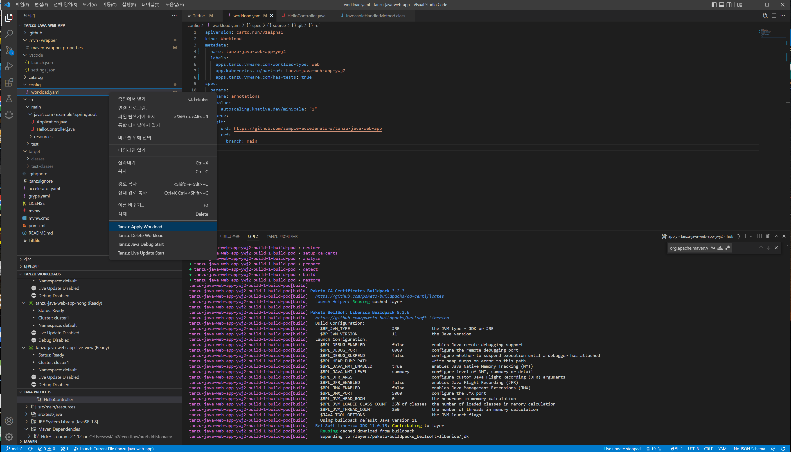
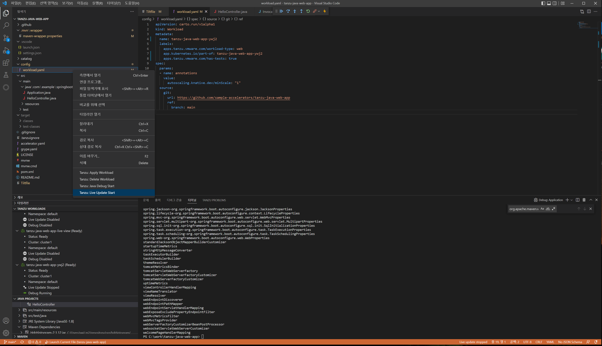
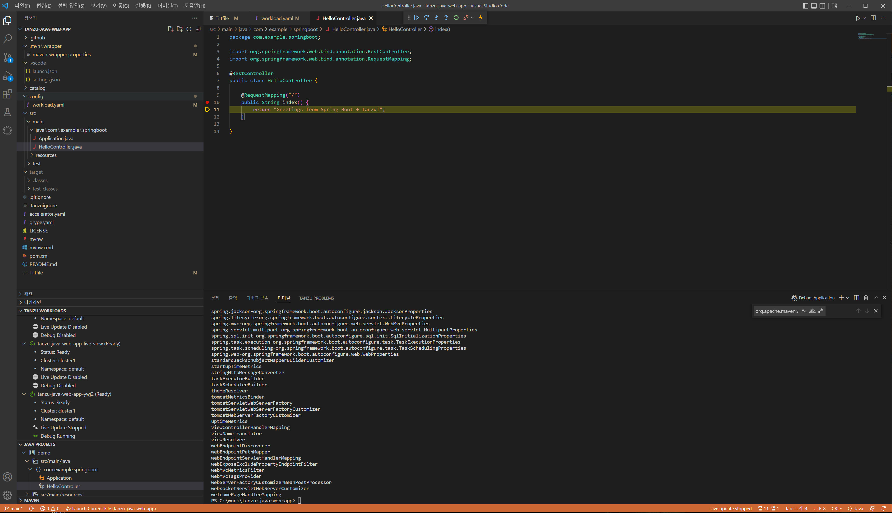
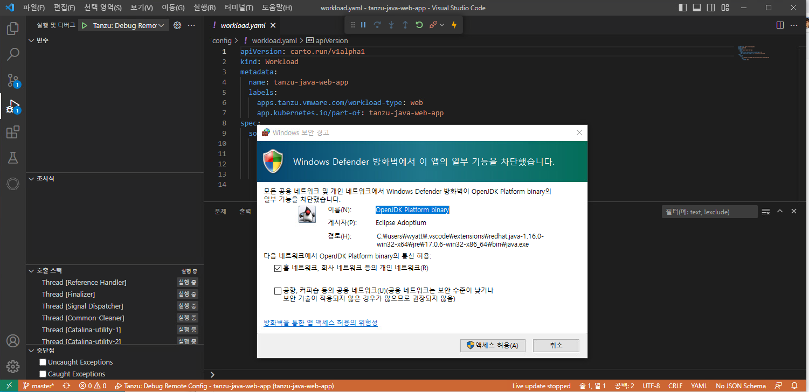
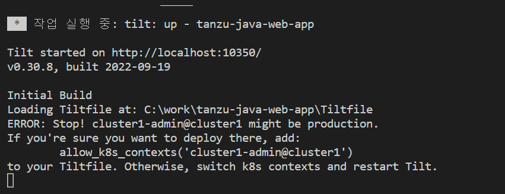
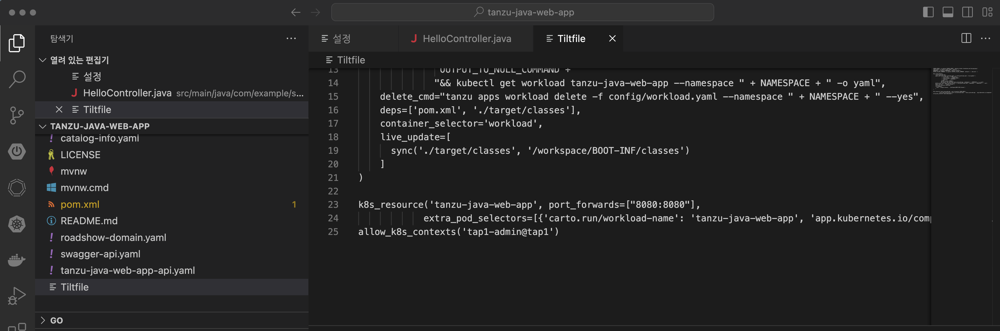
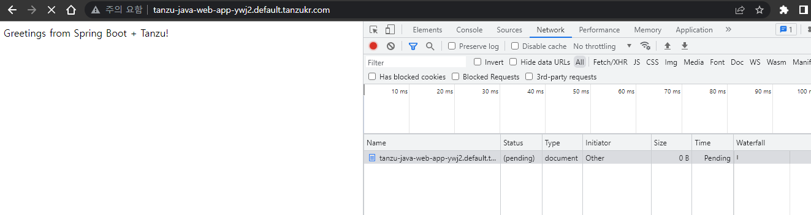
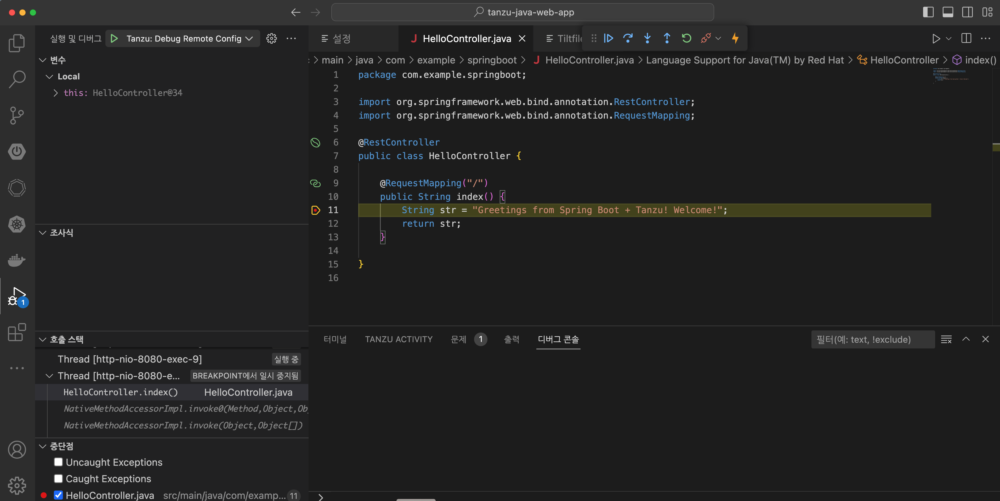
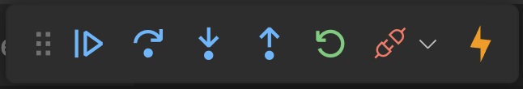

## 동적 배포와 원격 디버깅
여기서는 간단한 guide만 설명합니다. 자세한 내용은 아래의 주소에서 확인할 수 있습니다.

https://docs.vmware.com/en/VMware-Tanzu-Application-Platform/1.4/tap/vscode-extension-using-the-extension.html


### 1. IDE에서 앱 배포하기
1. 소스 download
    로컬 경로에 자신의 github.com 에 올려져 있는 tanzu-java-web-app을 git clone을 통해 소스를 다운로드 합니다.
    ```
    예:)    git clone https://github.com/wonjoyoo/tanzu-java-web-app
    ```
2. Visual Studio Code 에 '폴더 열기' 메뉴를 클릭하여 위에서 다운로드 받은 폴더를 엽니다.

3. workload 실행
    

4. app 확인
    app이 deploy가 되게 되면 아래의 형식으로 배포가 되게 됩니다.

    ```
        tanzu-java-web-app.네임스페이스.도메인명 
    ```

    브라우저에서 정상적으로 생성이 되었는지 확인을 해봅니다.

### 2. 동적 배포와 원격 디버깅
1. Live Update

    Live Update 기능을 시작합니다. 이때는 App을 새로 배포를 진행하게 됩니다.
        
    페이지가 정상적으로 열리는지 확인합니다.
    소스를 수정하고 변경사항이 바로 적용이 되는지 확인합니다. 보통 10초 이내에 반영이 됩니다.

2. 원격 Debug

    원격 클러스터에 배포되어 있는 app을 debug하기 위해서는 먼저 마우스로 소스에 break point를 설정하고 Debug Start 를 시작합니다.
    

    윈도우의 경우 내장 방화벽이 enable되어 있는 경우 아래와 같은 메세지가 나오게 됩니다. 액세스 허용을 누르면 됩니다.
    

    Tilt 파일에 아래와 같은 권한이 필요하다고 나옵니다. 동일하게 내용을 Tilt 파일의 제일 아래부분에 추가시킵니다.
    

3. Tilt 파일 수정
    ```
    allow_k8s_contexts('cluster1-admin@cluster1')
    ```
    

4. 페이지 호출
    다시 호출해서 workload가 Ready가 되면 페이지를 호출합니다. 페이지가 정상적으로 열리지 않고 pending상태가 되어 있는 것을 확인할 수 있습니다.
    
    이제 VS Code로 가서 코드를 확인합니다.
    
페이지가 호출되기 직전에 break point 지점에서 수행이 멈춘 것이고, 이때 IDE에서 왼쪽 상단의 변수값과 조사식에서 현재 들어있는 값 등을 확인할 수 있습니다.

    

    VS Code 상단에 있는  Resume(계속), Step Over(단위실행), Step In(단계정보) 기능을 사용하여 Debug를 수행합니다.

5. 디버그 종료
계속 버튼을 눌러 디버그를 종료하고 마지막 코드까지 실행을 완료 하면 페이지가 열리게 됩니다.
