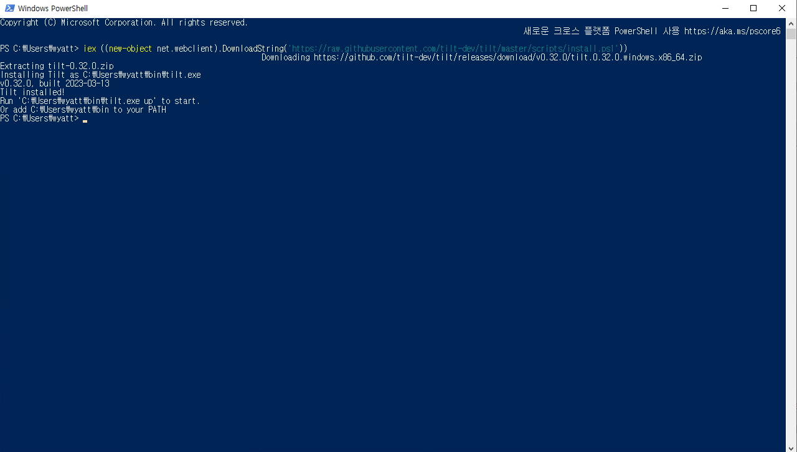
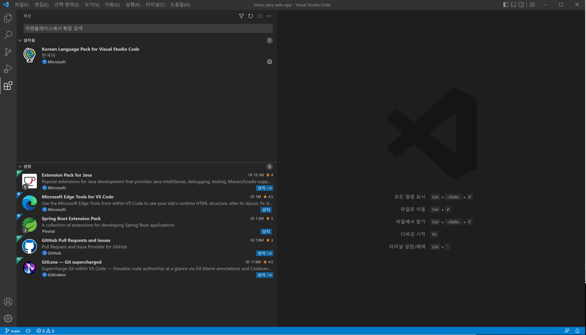
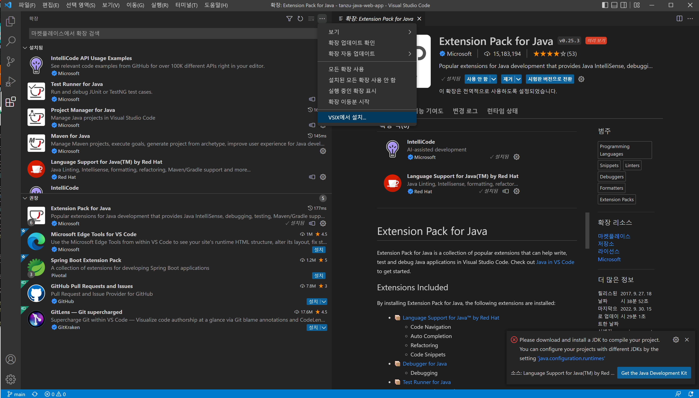
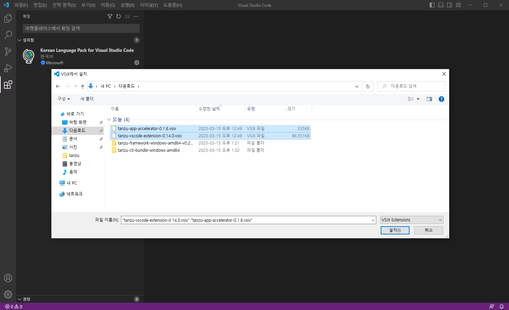
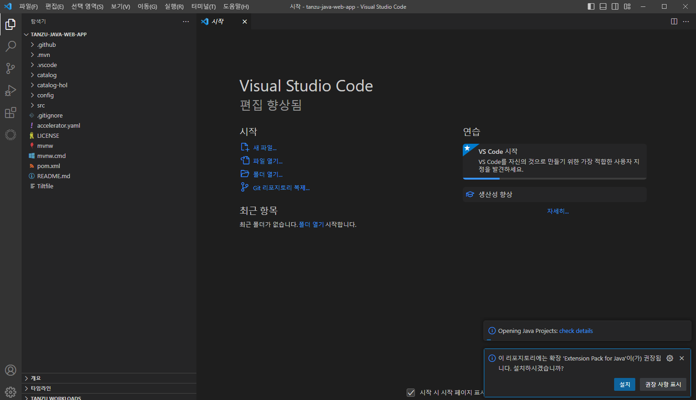
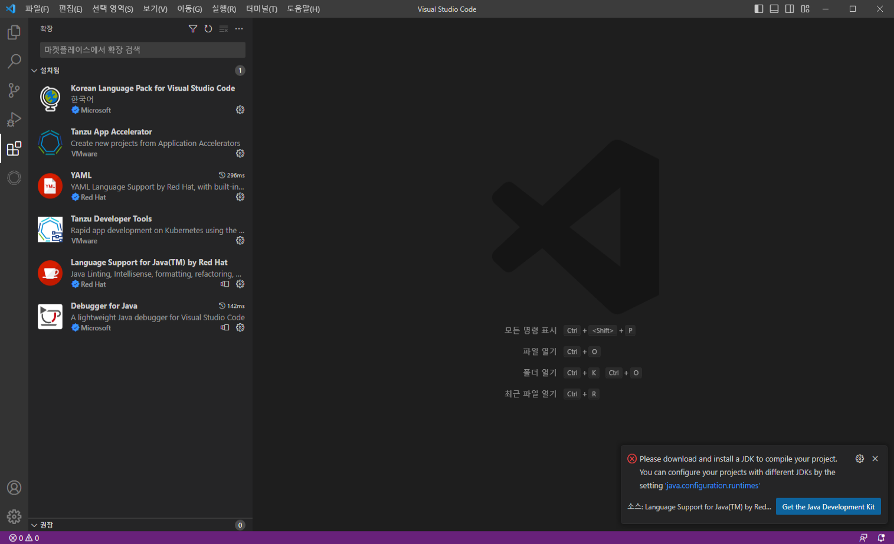
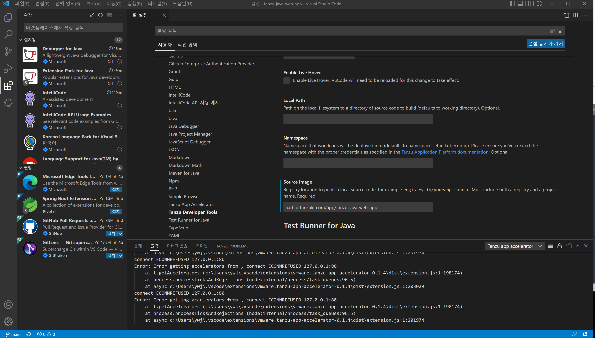

## 개발자 환경 - IDE 준비하기

TAP에서 제공하는 개발자 IDE Plugin을 실습하는 Lab입니다. TAP에서 제공하는 IDE plugin은 VS Code와 IntelliJ 입니다. 이번 Lab에서는 VS Code를 이용하여 실습을 하겠습니다.

### Local 환경 준비
개발자 PC 환경은 Mac과 윈도우를 지원하며, 이번 실습은 윈도우를 기본으로 가정하여 작성되었습니다.
아래의 파일들을 TAP가 접속이 가능한 Local PC에 다운로드 받으시기 바랍니다.

1. 개발자 필수 툴 설치<br>
개발자 PC는 TAP가 접속이 가능한 환경이어야 합니다.
    - Visual Studio Code 설치 : https://code.visualstudio.com/download
    - Git 설치 : https://git-scm.com/downloads
    - Docker Desktop 설치 : https://www.docker.com/products/docker-desktop/
        - 주의사항 : Docker Desktop을 설치하기 위해서는 OS에서 VT-x가 enable되어 있어야 합니다. VT-x는 CMOS에서 enable해야 합니다. Local PC가 윈도우인 경우에는 제어판->Windows Feautres에서 Hyper-v가 활성화 되어 있는지 확인하시면 됩니다.
            https://learn.microsoft.com/en-us/virtualization/hyper-v-on-windows/reference/hyper-v-requirements<br>
            만약 Local PC 대신 가상 vSphere VM에서 사용할 경우에는 VM->CPU->가상화 enable을 하셔야 합니다.
            https://docs.vmware.com/en/VMware-vSphere/7.0/com.vmware.vsphere.vm_admin.doc/GUID-2A98801C-68E8-47AF-99ED-00C63E4857F6.html

2. CLI 설치<br>
kubectl 설치 : https://kubernetes.io/docs/tasks/tools/#kubectl<br>
tanzu cli 설치 가이드 : [tanzu-cli](./tanzu-cli.md)

3. kube config 파일 복사<br>
tap에 kubectl로 접속하기 위한 .kube/config 파일을 다운로드 하여 local pc의 user 계정에 동일한 위치에 복사를 합니다.

4. kubectl 확인<br>
아래 명령어를 실행해서 TAP에 정상적으로 접속이 되는지 확인합니다.
    ``` 
    kubectl get pods
    tanzu apps workload list
    ```
5. JDK 설치<br>
    
    JDK8 까지는 Oracle JDK를 무료로 다운로드 받으실 수 있고, 이 후의 버전은 openjdk를 다운로드 받아 설치하면 됩니다.
    이 Lab에서는 윈도우용 Oracle JDK 8 U341를 다음의 경로에서 다운로드 받으실 수 있습니다.
    
    [Windows 64bit JDK 8 다운로드](https://onevmw.sharepoint.com/:u:/r/teams/TAPHOLWorkshop/Shared%20Documents/General/tap1.3.0/jdk-8u341-windows-x64.exe?csf=1&web=1&e=TqW8Iz)

    설치후에는 윈도우 환경변수로 JAVA_HOME을 설정하셔야 합니다.


6. Tilt 설치<br>
- tilt download 및 설치 
powershell 창을 열고 아래 명령어를 실행합니다.<br>
iex ((new-object net.webclient).DownloadString('https://raw.githubusercontent.com/tilt-dev/tilt/master/scripts/install.ps1'))



윈도우 이외 환경에서의 설치는 이 문서를 참고합니다.: https://docs.tilt.dev/install.html<br>


### VS Code Plugin설치하기

1. Visual Studio Code Plugin 설치
TAP는 Tanzu Developer Tool과 App Accelerator 2개의 플러그인을 제공합니다. 
    Tanzu net에서 다운로드를 받을 수 있습니다. Lab의 편의를 위해 아래의 경로에 있는 TAP1.5용 파일을 다운로드 합니다. plugin은 하위호환성을 제공하기 때문에 상위버전을 받아 사용할 수 있습니다. 다만 이때 tanzu cli도 같은 버전으로 설치를 해야 합니다.

    [tanzu-vscode-extension-0.14.0.vsix 다운로드](https://onevmw.sharepoint.com/:u:/r/teams/TAP201HOLWorkshop/Shared%20Documents/General/1.5/vscode/tanzu-vscode-extension-0.14.0.vsix?csf=1&web=1&e=eBf3aF)

    [app-accelerator-0.1.6.vsix 다운로드](https://onevmw.sharepoint.com/:u:/r/teams/TAP201HOLWorkshop/Shared%20Documents/General/1.5/vscode/tanzu-app-accelerator-0.1.6.vsix?csf=1&web=1&e=URkdGU)

    Visual Studio Code를 실행해서 VSIX를 설치합니다.
    
    
    

    설치시 같이 추천하는 아래의 plugin도 설치합니다.
    - Debugger for Java
    - Language Support for Java(™) by Red Hat
    - YAML
    
    

2. Java 언어 모드 설정
    
    설정화면에서 
    Code > Preferences > Settings Java > Server: Launch Mode 를 Standard로 변경합니다.
    

3. Source Image 설정
    VSCode plugin에서는 개발자 PC에서 작성된 소스를 docker image로 압축하여 harbor에 업로드를 하게 됩니다. 그 후에 해당 이미지를 source로 사용하여 TAP에 배포를 하게 됩니다.
    여기서는 소스가 저장될 docker registry인 harbor의 주소를 입력해줍니다.

    이때 repository 이름은 소스가 저장될 별도의 repository를 사용하시는 것을 권고합니다.
    예를 들어 tap-app 이라는 repository를 만들면 됩니다. 그 하위로 sources라는 이름으로 만들게 되면 app을 배포할때 마다 해당 이미지 이름의 하위로 tag가 변경이 되면서 업로드 되게 됩니다.
    이 tap-app repository에 대하여 개발자는 업로드 권한을 갖고 있어야 하며, 개발자 pc에서 docker login을 수행하여 해당 repository에 대한 credential을 생성해야 합니다.

    Code > Preferences > Settings > Extensions > Tanzu Developer Tools 에서 Source Image에 주소를 입력합니다.

    예:) harbor.tanzukr.com/tap-app/sources

    
    


7. host 파일 등록

    TAP와 DNS를 공유하고 있으면 아래와 같은 설정은 필요 없지만, DNS가 없는 경우에는 아래의 내용을 hosts 파일에 등록해야 합니다.<br>
    ```
    C:\Windows\System32\drivers\etc\hosts
    ```
    위 파일을 관리자 권한으로 연후에 아래의 내용을 입력합니다.
    ```
    jumpbox 서버IP    harbor.도메인명
    avi_vip    tap-gui.도메인명
    ```

8. CA certificate 등록

    Local PC에서 harbor에 접속이 필요하기 때문에 harbor의 CA 인증서를 다운로드 받아 Local PC에 등록을 해주어야 합니다.
    ```
    jumpbox에서 CA파일 위치 : /data/cert 
    ```

    위 경로에 있는 c.crt 파일을 local pc로 복사합니다.
    윈도우에서는 아래의 명령어를 실행해서 OS에 certificate를 등록합니다.
    ```
    certutil -addstore -f "ROOT" ca.crt
    ```

9. harbor에 로그인
   credential을 local에 저장하기 위해 harbor에 로그인을 합니다. 이 crential은 local pc에서 source image를 업로드할때 사용하게 됩니다.
    ```
    docker login harbor.도메인
    ```
