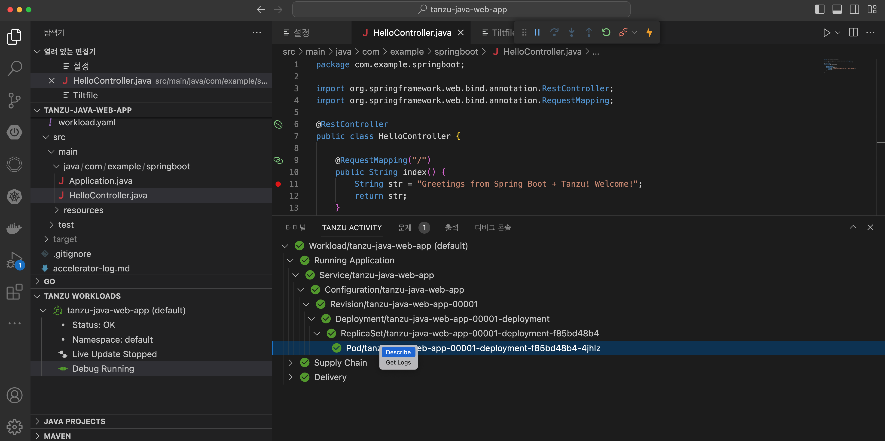
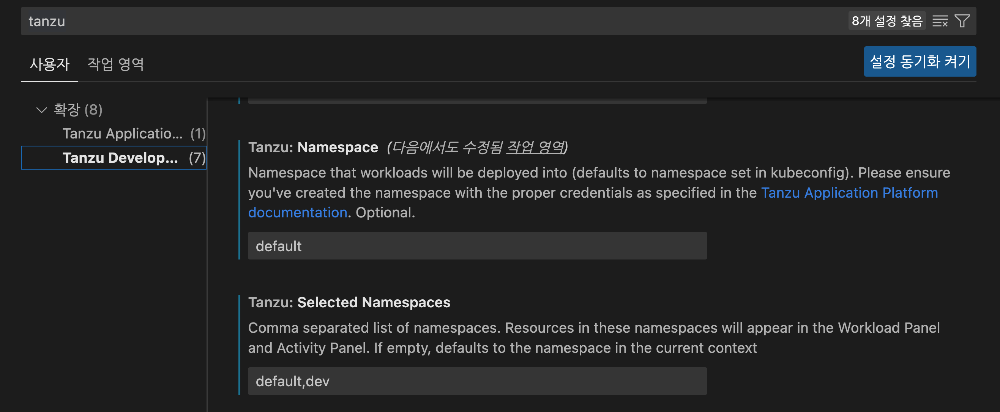

# IDE 기능 살펴보기
1. Tanzu Panel
Tanzu Panel은 workload가 생성된 후에 해당 workload를 구성하고 있는 component들의 상태를 확인할 수 있는 기능입니다.
자동으로 생성이 되는 Application, SupplyChain 등의 정보를 확인할 수 있습니다.
아래와 같이 해당 pod의 describe 정보가 Log도 확인이 가능합니다. 개발자는 자신이 생성한 application을 IDE 툴에서 바로 확인이 가능하게 됩니다.

2. Tanzu Workload 영역
VSCode 왼쪽 영역에 있는 Tanzu workload 영역에서는 workload들의 목록과 상태를 확인할 수 있습니다. 
개발자에게 할당된 namespaces에 실행중이 워크로드를 확인합니다. Live Update 중이거나 Debug중인 경우 Running으로 표시가 되게 됩니다.

3. Tanzu Workload의 namespace 설정
Tanzu workload 에 어떤 namespace를 보여줄지는 IDE plugin 설정에서 하게 됩니다.
설정 --> Tanzu Developer Tools에서 Selected Namespaces에 보기를 원하는 namespace를 입력합니다. 여러 namespace를 보기를 원할 경우 , 로  구분하여 입력합니다.
