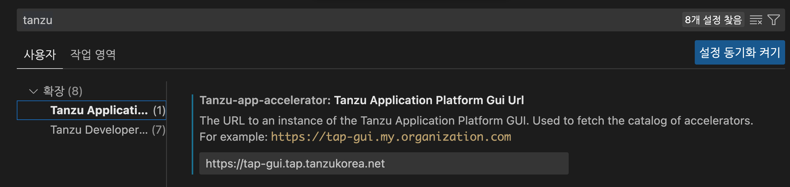
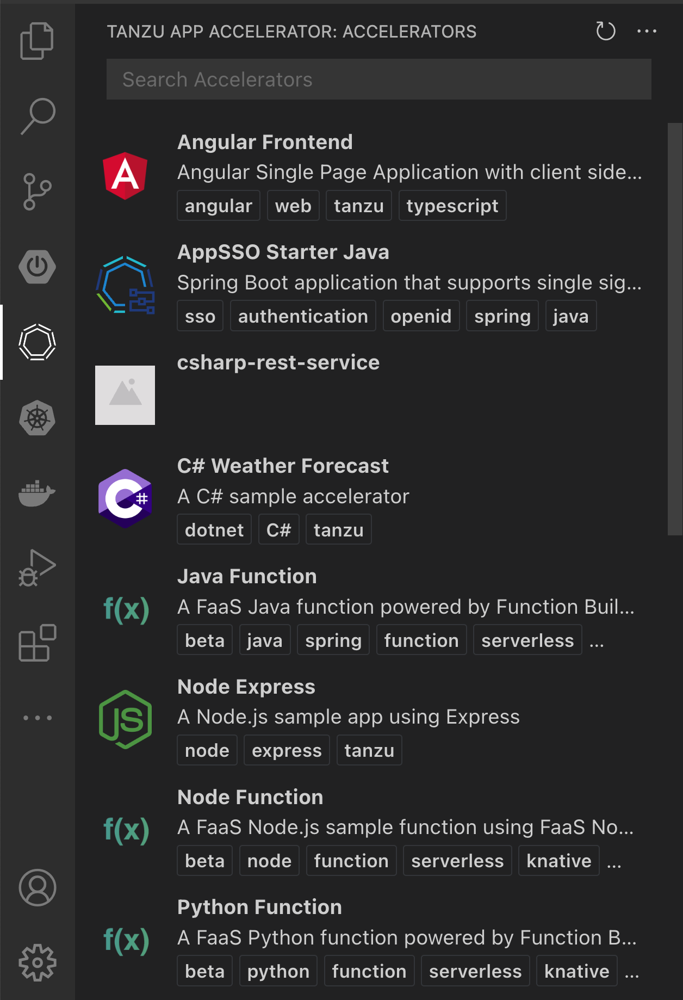
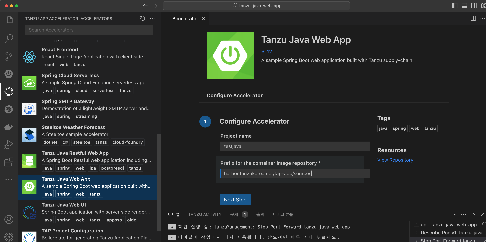
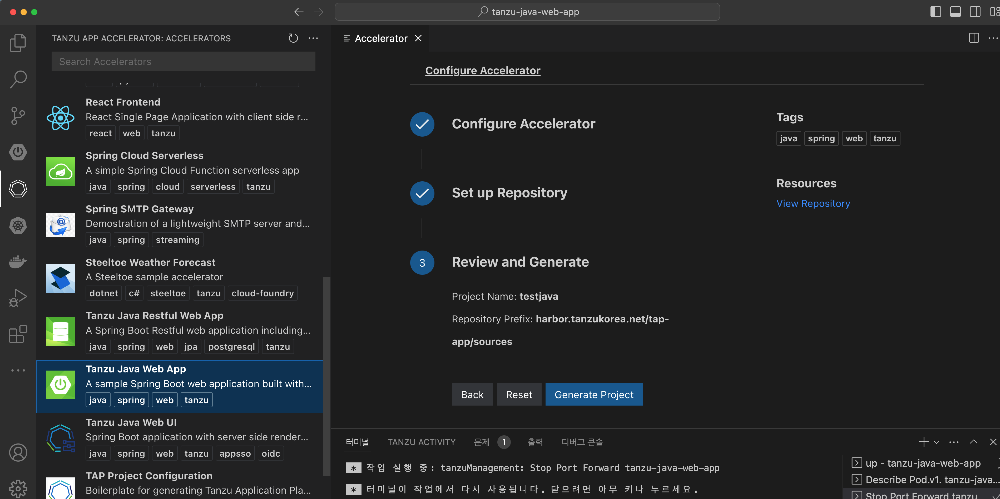
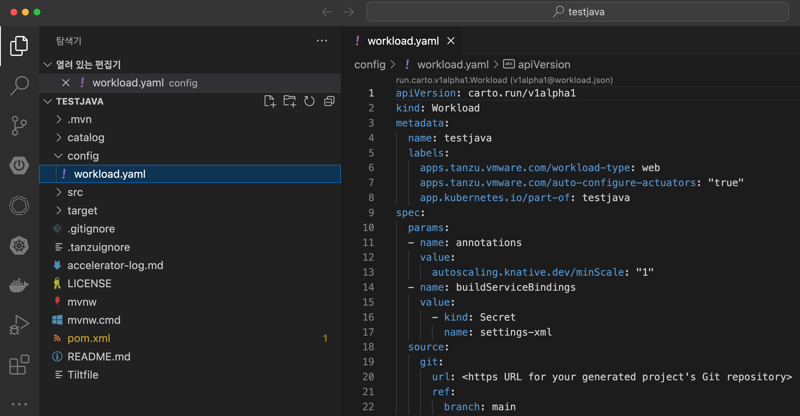
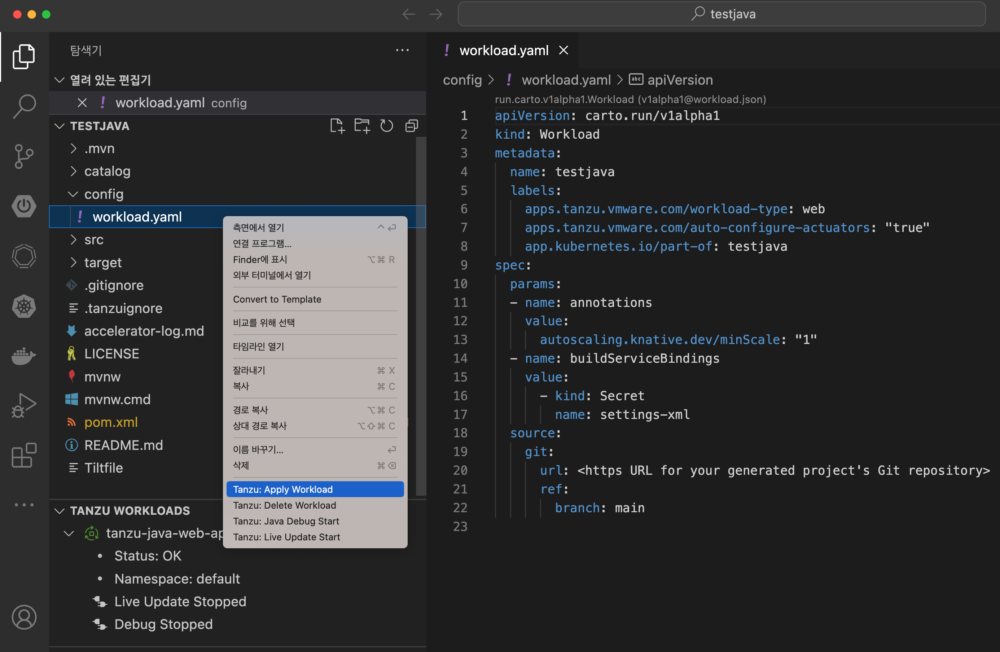

# IDE 에서 Accelerator로 개발하기

1. IDE 에서 Accelerator 설정하기
설정->Tanzu Application Accelerator 에서 tap의 주소를 입력합니다. 이때 IDE에서는 tap-gui 포탈에 접근해서 정보를 조회를 해오기 때문에 tap-gui의 url을 입력합니다.

2. 왼쪽 탐색기에서 Accelerator 아이콘을 클릭하면  Tap-gui 에서 보던 것과 동일한 Accelerator 목록이 나오게 됩니다. 

- 만약 이 목록이 나오지 않는 경우에는 다음을 확인하시기 바랍니다.
    -  tap-gui 포탈에서 accelerator 의 목록이 보이는지 확인합니다.
    - tap-gui의 인증서가 사설인증서인 경우 인증서를 개발자의 local pc에 입력해야 합니다.
3. 개발을 시작하기 위해서는 원하는 템플릿을 하나 선택한 후에 오른쪽에서 Project name을 입력합니다. 예)testjava

4. Set up Repository 기능은 템플릿을 다운로드 받음과 동시에 github과 연동하여 파일을 push하는 기능입니다. 이 기능을 사용하기 위해서는 tap설정시에 github계정이 연동되어 있어야 합니다.
여기서는 다음을 눌러서 skip합니다.

5. 마지막 단계에서 Generate Project를 클릭합니다.

6. 이렇게 생성된 프로젝트는 기존 템플릿을 복사해서 다운로드 받습니다. 위의 예제에서 testjava라는 프로젝트 이름을 생성을 했습니다. 이때 새 창에서 새 프로젝트를 열것인지 물어봅니다. 여기서는 Yes를 클릭합니다. 

7. testjava라는 프로젝트가 생성이 되었습니다. 관련 설정들이 모두 변경이 되게 됩니다. config/workload.yaml을 열어서 확인해봅니다.
Titlefile도 testjava 프로젝트 이름에 맞게 변경되어서 생성이 되게 됩니다.

8. 소스창에 오른쪽 마우스크를 클릭하여 Tanzu Apply Workload 를 클릭해서 바로 배포를 해봅니다.

9. 오른쪽 Log창에 application이 배포가 되는 로그를 확인할 수 있고 워크로드가 모두 배포가 되면 URL을 열어서 확인해봅니다. 