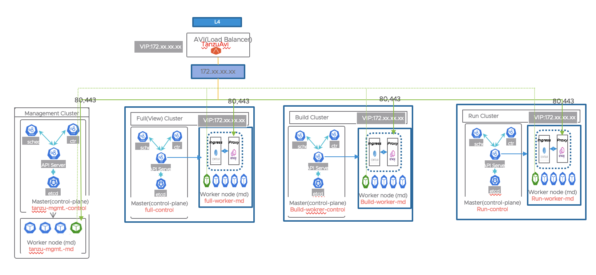

### 멀티 클러스터 구성 및 설정하기

다양한 환경과 구성으로 유연하게 Tanzu Application Platform을 설치 할 수 있습니다. VMware는 Production용으로 멀티클러스터 토폴로지를 테스트하고 권장합니다. 
유연성과 선택권이 Tanzu Application Platform의 설계의 핵심이기 때문에 구현 권장 사항은 명확하게 정해져 있지 않습니다. 이번 실습은 TAP를 멀티 클러스터로 구성하여 POC을 진행한다는 과정하에
최소의 클러스터로 구성 및 설정을 진행해보겠습니다. Full로 설치된 클러스터는 View,Iterate 공통으로 사용되는 클러스터 이며, Build 클러스터는 OOTB 파이프라인으로 실제로 빌드가 실행되는 클러스터, 
마지막으로 Run 클러스터는 배포할 workload가 배포되는 클러스터입니다.

- Iterate: 내부 루프 반복 응용프로그램 개발을 위한 것입니다.

- Build: 소스 리비전을 워크로드 리비전, 특히 호스팅 워크로드 및 공급망으로 변환합니다.

- Run: 워크로드 수정사항을 실행 중인 포드로 변환합니다. 특히, 제공 및 제공물 호스팅.

- View: 중앙 집중식 개발자 경험과 관련된 애플리케이션, 특히 Tanzu Application Platform GUI 및 메타데이터 스토어.

- 각 클러스터 별 설정 정보는 다음과 같습니다. 설치 가이드는 각 클러스터 명을 클릭하시기 바랍니다.
   |클러스터 명|프로파일 명|Supply Chain|용도|
   |---|---|---|---|
   |[여기 클릭(full)](../install/multicluster/full/install-full.md)|full|basic|1) 개발자가 사용할 iterate 클러스터 및 2)TAP GUI가 설치될 view 클러스터|
   |[여기 클릭(build)](../install/multicluster/buildc/install-build.md)|build|testing_scanning|소스 및 이미지를 테스트, 스캐닝하고 워크로드를 빌드하여 이미지를 생성할 클러스터|
   |[여기 클릭(run)](../install/multicluster/run/install-run.md)|run|-|워크로드가 구동될 클러스터|
- TAP Multi Cluster 설치에 대한 자세한 설치 방법은 [여기](https://docs.vmware.com/en/VMware-Tanzu-Application-Platform/1.4/tap/multicluster-installing-multicluster.html)를 참조하시기 바랍니다.

