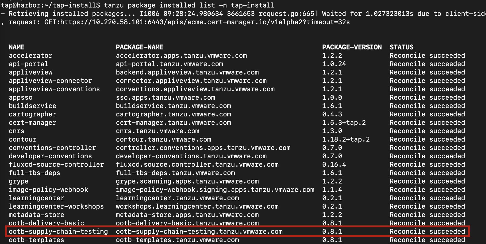
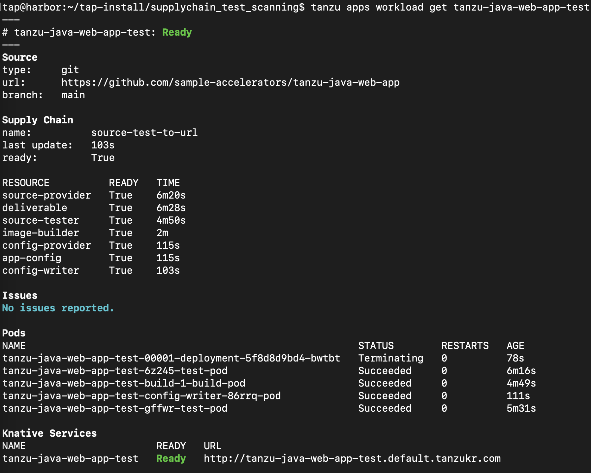
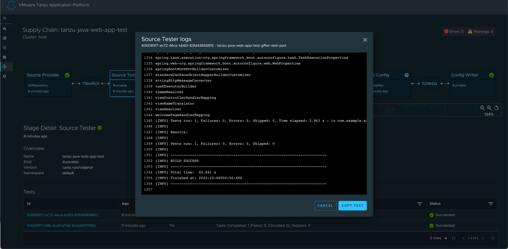

# Supply Chain 변경

본 과정에서는 TAP (Tanzu Application Platform)의 OOTB Supply Chain을 basic에서 testing 및 testing_and_scanning으로 변경하는 방법에 대해 알아보겠습니다.

* OOTB Supply Chain - Testing을 설치합니다.
* 클러스터에 Tekton 파이프라인을 추가하고, 파이프라인을 가리키도록 워크로드를 업데이트 하여 오류를 해결합니다.
* OOTB Supply Chain - Testing and Scanning을 설치합니다.
* 취약점 및 종속성을 쿼리합니다.
* [참고 링크](https://docs.vmware.com/en/VMware-Tanzu-Application-Platform/1.2/tap/GUID-getting-started-add-test-and-security.html)

## 1.OOTB Supply Chain - Testing 

### 1) Tekton Pipeline 설정

tap-values.yaml 에서 supply chain에 대한 정보가 있는 Line을 다음과 같이 업데이트합니다.
~~~
- supply_chain: basic
+ supply_chain: testing

- ootb_supply_chain_basic:
+ ootb_supply_chain_testing:
    registry:
      server: "SERVER-NAME"
      repository: "REPO-NAME"
~~~

변경된 프로필로 패키지를 업데이트합니다.
~~~
tanzu package installed update tap -p tap.tanzu.vmware.com -v 1.2.1 --values-file tap-values.yaml -n tap-install
~~~

패키지가 적용되었는지 다음 명령어를 통해 확인합니다.
~~~
tanzu package installed list -n tap-install
~~~

아래와 같이 ootb-supply-chain-testing이 적용되었음을 확인합니다.

다음 단계로는 Tekton Pipeline을 업데이트 합니다. 예시 yaml은 Jumpbox의 ~/tap-install/supplychain_test_scanning/tekton_pipeline.yaml 혹은 [링크](../install/tekton_pipeline.yaml) 에서 확인 가능합니다. 해당 Yaml 파일을 적용합니다.

~~~
kubectl apply -f tekton_pipeline.yaml)
~~~

yaml 파일에 정의된 step을 통해 개발자 워크로드에 표시된 repository 에서 코드를 가져오고 repository 내에서 테스트를 실행합니다. Tekton 파이프라인의 단계는 구성 변경이 가능하며 개발자가 코드를 테스트하는 데 필요한 추가 항목을 추가할 수 있습니다.

다음 단계로는 워크로드를 새로운 supply chain과 연결 해야 합니다. 다음 명령어를 통해 수행합니다.

~~~
tanzu apps workload create tanzu-java-web-app \
  --git-repo https://github.com/sample-accelerators/tanzu-java-web-app \
  --git-branch main \
  --type web \
  --label app.kubernetes.io/part-of=tanzu-java-web-app \
  --label apps.tanzu.vmware.com/has-tests=true \
  --yes \
  --namespace default
~~~

배포가 끝난 후 tanzu apps workload get 명령어로 조회하면 이전과 다르게 Resource에 source-tester가 추가되었으며 pod에도 test-pod가 succeed 되었음을 확인 가능합니다.

GUI로 이동해 Supply Chain을 확인합니다.

각 테스트의 id를 클릭해 detail 정보를 확인할 수 있습니다.

