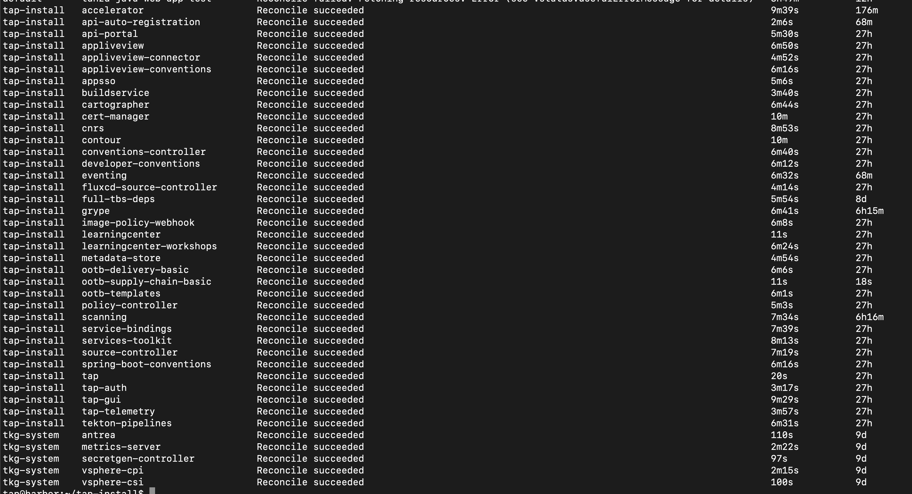
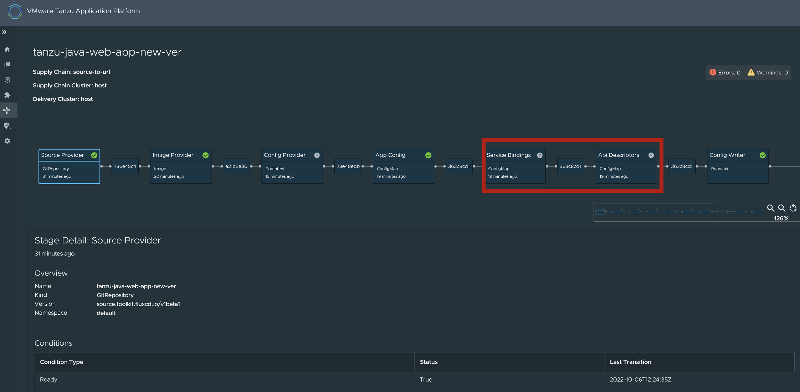

# Upgrade

본 과정에서는 TAP (Tanzu Application Platform)의 버전을 업그래이드 합니다. 현재 설치된 버전은 v1.2.1이며, v1.3.0-rc.1으로 업그레이드를 진행합니다.


## 1.파일 다운받기
Teams > General > tap1.3.0의 두 파일을 모두 다운로드 받습니다.

## 2. 레지스트리 로그인
점프박스 VM에서 다음의 레지스트리에 로그인을 합니다. 

### 1) 하버 레파지토리 웹 페이지 접속
```
https://harbor.tanzukr.com
```

### 2) TAP 설치 이미지를 저장할 사설 레지스트리 로그인
```
docker login harbor.tanzukr.com
```

## 3. 사설 레지스트리에 이미지 복사
다음 명령어를 사용하여 점프박스 VM에 파일로 저장된 이미지를 사설 레지스트리(여기서는 하버 레파지토리)로 복사합니다. 
```
imgpkg copy --tar tap-packages-1.3.0-rc.1.tar --to-repo harbor.tanzukr.com/tanzu-application-platform/tap-packages --include-non-distributable-layers --registry-verify-certs=false
```
> **_NOTE:_** 사설 인증서로 인증된 사설 레지스트리를 사용하는 경우 registry-verify-certs 옵션을 사용하여 레지스트리 인증을 생략할 수도 있습니다.

빌드 서비스 디펜던시를 위한 이미지도 복사합니다.
```
imgpkg copy --tar full-tbs-deps-package-repo-1.7.2.tar --to-repo harbor.tanzukr.com/tanzu-application-platform/full-tbs-deps-package-repo --include-non-distributable-layers  --registry-verify-certs=false
```

## 4. TAP package repository 업데이트
타겟 버전으로 package repository를 업데이트합니다.
~~~
tanzu package repository add tanzu-tap-repository \
--url harbor.tanzukr.com/tanzu-application-platform/tap-packages:1.3.0-rc.1 \
--namespace tap-install
~~~

새로운 package repository가 잘 설치되었는지 검증합니다. 아래 명령어를 실행했을 때 Reconcile Succeeded가 나오면 다음 단계로 넘어갑니다.
~~~
tanzu package repository get tanzu-tap-repository --namespace tap-install
~~~

## 5. Upgrade
Tanzu Application Platform은 설치할 때 수행했던 profile (tap-values.yaml)을 기반으로 업그레이드됩니다. 아래의 명령어를 실행합니다.

~~~
tanzu package installed update tap -p tap.tanzu.vmware.com -v 1.3.0-rc.1 --values-file test-tap-values.yaml -n tap-install
~~~

시간이 다소 소요되며, 업그레이드 후 다음 명령어로 검증합니다.
~~~
tanzu package installed list --namespace tap-install
~~~

수행 시 cnrs 및 tap 패키지의 경우 reconcile failed 메시지가 확인됩니다. 이는 tap가 1.3버전으로 업그레이드되면서 cnr 관련 config 일부가 deprecate 되었기 때문입니다. <br/>
tap-values.yaml에서 다음 부분을 삭제합니다.
~~~
cnrs:
  domain_name: tanzukr.com
  ingress:
    reuse_crds: true <- 해당 줄 삭제
    external:
      namespace: tanzu-system-ingress
~~~

이후 패키지를 업데이트합니다.
~~~
tanzu package installed update tap -p tap.tanzu.vmware.com -v 1.3.0-rc.1 --values-file test-scan-tap-values.yaml -n tap-install
~~~

아래 캡쳐와 같이 cnrs 및 tap가 정상적으로 설치되었음을 확인 후 다음 단계로 넘어갑니다.




## 6. 워크로드 배포 및 변경사항 확인
Tanzu Application Platform 1.3버전에는 몇 가지 추가 요소가 있습니다. UI에서 조금 더 자세한 확인을 위해 워크로드를 배포해 보겠습니다. <br/>
아래 워크로드는 supply chain basic 기준입니다.
~~~
tanzu apps workload create tanzu-java-web-app-new-ver \
   --git-repo https://github.com/sample-accelerators/tanzu-java-web-app \
   --git-branch main \
   --type web \
   --label app.kubernetes.io/part-of=tanzu-java-web-app \
   --yes \
   --namespace default
~~~

배포 후 GUI의 Supply Chain을 보면 아래 사진과 같이 service binding 및 api descriptor 정보가 supply chain에 추가되었음을 확인 가능합니다. 


다음은 supply chain을 testing_scanning으로 변경했을 때 결과입니다.
